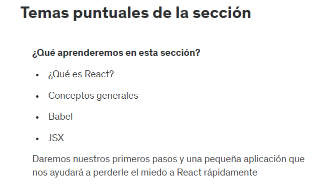

# 6. INTRODUCCION A LA SECCION

# 7. TEMAS PUNTUALES DE LA SECCION



# 8. ¿QUE ES REACT?

React es una biblioteca de JavaScript de codigo abierto, desarrollada por Facebook, que se utiliza para crear interces de usuario interactivas y dinamicas. Es una de las herramientas mas populares para el desarrollo web front-end, especialmente para aplicaciones web de una sola pagina (SPA).

# 9. PRIMEROS PASOS EN REACT

Ejemplo 1:

```html
<!DOCTYPE html>
<html lang="en">
<head>
    <meta charset="UTF-8">
    <script crossorigin src="https://unpkg.com/react@16/umd/react.production.min.js"></script>
    <script crossorigin src="https://unpkg.com/react-dom@16/umd/react-dom.production.min.js"></script>
    <script src="https://unpkg.com/babel-standalone@6/babel.min.js"></script>

    <title>ReactApp</title>
</head>
<body>
    <div id="root"></div>
    <script type="text/babel">
        const divRoot = document.querySelector('#root');
        const h1Tag = <h1>Hola Mundo</h1>;
        ReactDOM.render(h1Tag, divRoot);
    </script>
</body>
</html>
```

Ejemplo 2:

```html
<!DOCTYPE html>
<html lang="en">
<head>
    <meta charset="UTF-8">
    <script crossorigin src="https://unpkg.com/react@16/umd/react.production.min.js"></script>
    <script crossorigin src="https://unpkg.com/react-dom@16/umd/react-dom.production.min.js"></script>
    <script src="https://unpkg.com/babel-standalone@6/babel.min.js"></script>

    <title>ReactApp</title>
</head>
<body>
    <div id="root"></div>
    <script type="text/babel">
        const divRoot = document.querySelector('#root');
        const nombre = 'Goku';
        const h1Tag = <h1>Hola, soy { nombre }</h1>;
        ReactDOM.render(h1Tag, divRoot);
    </script>
</body>
</html>
```

# 10. INTRODUCCION A BABEL

- Babel: Es un transpilador de codigo abierto y gratuito que se utiliza principalmente para convertir codigo JavaScript modermo a una version compatible con navegadores mas antiguos. Esto permite a los desarrolladores utilizar las ultimas caracteristicas de JavaScript sin preocuparse por la compatibilidad con navegadores antiguos.

https://babeljs.io/