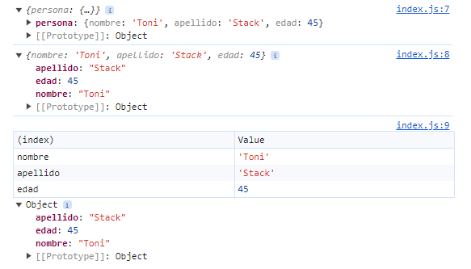
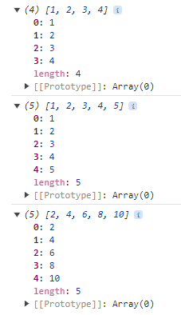

# 11. INTRODUCCION A LA SECCION


# 12. TEMAS PUNTUALES DE LA SECCION


# 13. INICIO DE PROYECTO - BASES DE JAVASCRIPT

Crear proyecto en React
https://create-react-app.dev/

Se usa el siguiente comando:
npx create-react-app my-app

# 14. VARIABLES Y CONSTANTES

```js
const nombre = 'Fernando';
const apellido = 'Herrera';

let valorDado = 5;
valorDado = 4;

console.log(nombre, apellido, valorDado);

// var NO se debe de usar
if (true) {
    const nombre = 'Peter';
    console.log(nombre);
}
console.log(valorDado);
```

# 15. TEMPLATE STRING

```js


const nombre = 'Walter';
const apellido = 'Suel';

const nombreCompleto = `
${ nombre } ${ apellido }`;

console.log(nombreCompleto);

function getSaludo(nombre) {
    return 'Hola ' + nombre;
}

console.log(`Este es un texto: ${ getSaludo(nombre) }`)
```

# 16. OBJETOS LITERALES

```js
const persona = {
    nombre: 'Toni',
    apellido: 'Stack',
    edad: 45,
    direccion: {
        ciudad : 'New York',
        zip: 55321321,
        lat: 14.3232,
        lng: 34.9233321,
    }
};
//console.log({persona}); //con esto se obtiene el nombre del objeto
//console.log(persona) // Se obtiene las propiedades del objeto, pero no se puede conocer el nombre del objeto
//console.table(persona); //muestra los datos en una tabla


/*
Con los 3 puntos se expande las propiedades de un objeto a otro objeto. En este caso copiamos o clonamos las propiedades de persona 1 en persona 2.
Una forma incorrecta de clonacion es esta:
const persona2 = persona1

El operador ... se llama operador de progagacion (spread operator)
*/
const persona2 = { ...persona};
persona2.nombre = 'Peter';

console.log( persona );
console.log( persona2 );
```




# 17. ARREGLOS

```js
// const arreglo = new Array( 100 );

/*const arreglo = [];
arreglo.push(1);
arreglo.push(2);
arreglo.push(3);
arreglo.push(4);*/

const arreglo = [1, 2, 3, 4];

/*No es recomendable usar push para insertar un elemento a un arreglo, sino es recomendable usar el operador spread*/

let arreglo2 = [...arreglo, 5];

const arreglo3 = arreglo2.map(function (numero) {
    return numero * 2;
})

console.log(arreglo);
console.log(arreglo2);
console.log(arreglo3);
```

