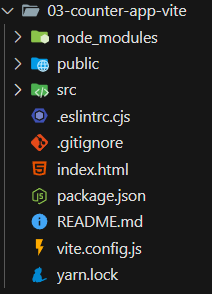
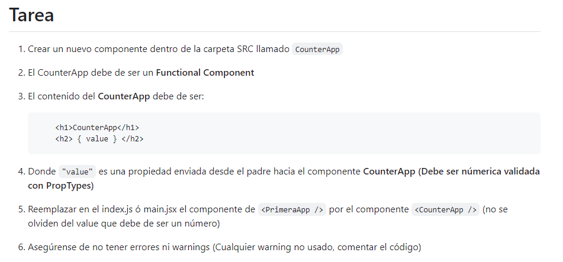

# 29. Introduccion a la seccion

# 30. Temas puntuales de la seccion

¿Qué veremos en esta sección?

- Nuestra primera aplicación - Hola Mundo
- Exposiciones sobre los componentes
- Creación de componentes (Functional Components)
- Propiedades - Props
- Impresiones en el HTML
- PropTypes
- DefaultProps
- Introducción general a los Hooks
- useState

Es una sección importante, especialmente para todos los que están empezando de cero en React, ya que dará las bases de cómo segmentar la lógica de nuestra aplicación en pequeñas piezas más fáciles de mantener.

# 31. ¿Que son los componentes?

En React, los "componentes" son los bloques fundamentales para construir interfaces de usuario reutilizables y modulares. Un componente en React es una parte independiente y reutilizable de la interfaz de usuario que contiene tanto la lógica como la interfaz visual de una parte específica de la aplicación.

# 32. Primera aplicacion de React

El comando "yarn create vite" es utilizado para crear un nuevo proyecto usando Vite, que es una herramienta de desarrollo rápida para aplicaciones web modernas, especialmente optimizada para frameworks como Vue.js y React. 

Luego en esta clase tambien se creo un proyecto con create-react-app para luego ver la diferencia entre las creaciones de proyectos de ambas.

# 33. Estructura de directorios CRA


1. node_modules: Este directorio contiene todas las bibliotecas y dependencias que tu proyecto necesita, las cuales son gestionadas por npm o Yarn. No se debe modificar manualmente.

2. public: Este directorio alberga archivos estáticos como el index.html y cualquier otro recurso que necesites accesible públicamente en tu aplicación. Aquí también puedes incluir imágenes, iconos o archivos de manifiesto.

3. src: Es el directorio más importante porque contiene todo el código fuente de tu aplicación React. Aquí encontrarás los componentes de React, hojas de estilo, imágenes (si decides importarlas a través de JavaScript) y cualquier otro código relacionado con la lógica de tu aplicación.

- App.js o App.jsx: Es el componente principal de React donde se suelen juntar otros componentes.
- index.js o index.jsx: Es el punto de entrada de la aplicación React, donde el componente App se monta en el DOM.

4. .gitignore: Este archivo le indica a Git qué archivos o directorios completos deben ignorarse en las operaciones de control de versión. Normalmente incluye node_modules y otros archivos que no deseas enviar a tu repositorio.

5. package-lock.json (si estás usando npm) o yarn.lock (si usas Yarn): Estos archivos aseguran que se instalen exactamente las mismas versiones de todas las dependencias en cualquier instalación del proyecto. Esto ayuda a evitar discrepancias en los entornos de desarrollo entre diferentes desarrolladores.

6. package.json: Contiene la configuración de tu proyecto, lo que incluye scripts de arranque, información del proyecto y las dependencias que tu proyecto necesita para funcionar. Aquí puedes agregar scripts personalizados para arrancar el servidor, compilar el proyecto, etc.

7. README.md: Un archivo Markdown que se utiliza para describir el proyecto, cómo configurarlo, cómo contribuir a él, entre otros detalles. Es una buena práctica mantener este archivo actualizado con información útil sobre tu proyecto.

# 34. Estructura de directorios - Vite



1. node_modules: Almacena todas las dependencias del proyecto, que se instalan a través de npm o Yarn. Este directorio es generado automáticamente y no se debe modificar directamente.

2. public: Contiene archivos que deben servirse sin ser procesados por Vite, como el archivo index.html. Puedes colocar aquí otros recursos estáticos, como imágenes o archivos robots.txt.

3. src: Directorio que contiene el código fuente de tu aplicación, incluyendo los componentes de React, hojas de estilo CSS, y JavaScript. Este es el corazón de tu aplicación, donde escribes la mayor parte del código.

4. .eslintrc.js: Archivo de configuración para ESLint, una herramienta de análisis de código para identificar patrones problemáticos en el código JavaScript. Te ayuda a mantener tu código limpio y conforme a las mejores prácticas.

5. .gitignore: Este archivo especifica intencionalmente los archivos no rastreados que Git debe ignorar. Por ejemplo, node_modules es una entrada común en este archivo, ya que no quieres que tus dependencias se almacenen en el repositorio.

6. index.html: El archivo HTML raíz para tu proyecto que actúa como punto de entrada para la aplicación web. Vite lo utiliza para inyectar automáticamente los scripts necesarios durante el desarrollo y la construcción.

7. package.json: Describe tu proyecto y sus dependencias. También define los scripts de proyecto que puedes ejecutar para tareas como iniciar el servidor de desarrollo y construir tu aplicación.

8. README.md: Un archivo de documentación que generalmente incluye información sobre el proyecto, cómo instalarlo, configurarlo y usarlo.

9. vite.config.js: Este archivo de configuración específico de Vite te permite personalizar cómo Vite construye tu aplicación. Aquí puedes ajustar configuraciones como plugins, resolvers, y transformaciones específicas.

10. yarn.lock: Similar al package-lock.json de npm, este archivo asegura que las dependencias permanezcan consistentes en todos los entornos de instalación. Es creado y actualizado automáticamente por Yarn.

# 35. Hola Mundo en React

```react
import React from 'react';
import ReactDOM from 'react-dom/client';

function App() {
    return (<h1>Hola Mundo!!!</h1>);
}

ReactDOM.createRoot(document.getElementById('root')).render(
    <React.StrictMode>
        <App />
    </React.StrictMode>
);
```

- import React from 'react'; - Importa la biblioteca de React para que puedas utilizar JSX y otros elementos de React en tu archivo.
- import ReactDOM from 'react-dom/client'; - Importa las funciones específicas de ReactDOM necesarias para interactuar con el DOM del navegador. En este caso, se usa la nueva API de cliente de ReactDOM (introducida en React 18) que mejora la gestión de raíces del DOM.
- Define un componente funcional llamado App. Este es un componente simple que retorna un elemento JSX, que en este caso es un elemento h1 conteniendo el texto "Hola Mundo!!!".
- ReactDOM.createRoot(document.getElementById('root')): Esta línea crea una raíz de React en el elemento del DOM con el id root. Esta es la nueva forma de montar aplicaciones React con la API de cliente en React 18, lo que facilita mejoras futuras como la concurrencia.
- React.StrictMode: React.StrictMode es una herramienta para detectar problemas potenciales en una aplicación React. No afecta la build de producción, pero en el desarrollo, ayuda con cosas como:Identificar componentes con estados inseguros. Advertir sobre usos obsoletos de la API. Detectar efectos secundarios inesperados durante el renderizado.
- App />: Esto es JSX que representa el componente App que definiste anteriormente. Al colocarlo dentro de React.StrictMode, aseguras que el modo estricto revise este componente y sus hijos.
- .render(...): Este método toma un elemento React (en este caso, un árbol de componentes envuelto en React.StrictMode) y lo monta en el DOM, haciéndolo visible para los usuarios.

# 36. Nuestro primer componente

```js
//Archivo main.jsx
import React from 'react';
import ReactDOM from 'react-dom/client';
import { App } from './HelloWorldApp';

ReactDOM.createRoot(document.getElementById('root')).render(
    <React.StrictMode>
        <App />
    </React.StrictMode>
);
```

```js
//Archivo HelloWorldApp.jsx
export function App() {
    return (<h1>Hola Mundo!!!</h1>);
}
```

# 37. Tarea - Crea un nuevo componente

```js
// Archivo FirstApp.jsx
export function FirstApp(params) {
    return <h1>Pagina: First App</h1>
}
```

```js
// Archivo main.jsx
import React from 'react';
import ReactDOM from 'react-dom/client';
import { FirstApp } from './FirstApp';
//import { App } from './HelloWorldApp';

ReactDOM.createRoot(document.getElementById('root')).render(
    <React.StrictMode>
        <FirstApp />
    </React.StrictMode>
);
```

# 38. Retornar elementos en el Componente - Fragment

```js
//Archivo FirstApp.jsx
import { Fragment } from "react"

export const FirstApp = () => {
    return(
        <Fragment>
            <h1>Walter Suel</h1>
            <p>Soy ingeniero</p>
        </Fragment>
    )
}
```

El Fragment en React se utiliza para agrupar múltiples elementos hijos sin agregar nodos adicionales innecesarios al DOM. Es especialmente útil cuando necesitas devolver varios elementos adyacentes en un componente de React, ya que React requiere que un componente devuelva un solo elemento padre. 

Si no queremos importar el fragmento simplemente borramos la importacion, y borramos la etiqueta de fragmento, poniendo solo las llaves de menor y mayor, tal como se muestra a continuacion:

```js
export const FirstApp = () => {
    return(
        <>
            <h1>Walter Suel</h1>
            <p>Soy ingeniero</p>
        </>
    )
}
```

# 39. Impresión de variables en el HTML

No podemos mandar directamente un objeto en react.

En React, cuando estás renderizando componentes o elementos JSX, no puedes enviar directamente un objeto JavaScript como atributo de un componente. Esto se debe a que los atributos en JSX deben ser evaluados como expresiones y deben seguir ciertas reglas para ser correctamente interpretados por React y renderizados en el DOM. 

Si queremos mostrar obligatoriamente el objeto usamos: JSON.stringify

```js
//const newMessage = 'Walter Suel!!!'
//const newMessage = [1, 2, 3, 4, 5, 6, 7, 8, 9];
const newMessage = {
    message: 'Hola Mundo',
    title: 'Walter'
}

export const FirstApp = () => {
    return(
        <>
            <code>{JSON.stringify(newMessage)}</code>
            <p>Soy ingeniero</p>
        </>
    )
}
```

Las promesas actuan como objetos por lo que si hay funciones asincronas estas tambien seran rechazadas por react

```js
//const newMessage = 'Walter Suel!!!'

//const newMessage = [1, 2, 3, 4, 5, 6, 7, 8, 9];

// const newMessage = {
//     message: 'Hola Mundo',
//     title: 'Walter'
// }

const saludo = () => {
    return "Te saluda una funcion";
}

export const FirstApp = () => {
    return(
        <>
            <h1>Hola Mundo</h1>
            <h1>{saludo()}</h1>
            {/* <code>{JSON.stringify(newMessage)}</code> */}
            <p>Soy ingeniero</p>
        </>
    )
}
```

# 40. Colocar estilos de CSS

```css
html, body {
    background-color: #21232A;
    color: white;
    font-family: Helvetica, Arial, sans-serif;
    font-size: 1.3rem;
    padding: 70px;
}
```

No olvidemos que tenemos que importarlo en el main para que se aplique los estilos globales

# 41. Comunicacion entre componentes - Props

En React, las "props" (abreviatura de "properties", que en español significa propiedades) son un mecanismo fundamental para pasar datos de un componente padre a un componente hijo. Las props son simplemente objetos JavaScript que contienen información que puede ser utilizada por un componente React.

Ejemplo: 

// Ejemplo de componente funcional que recibe props
const Greeting = (props) => {
    return <h1>Hola, {props.nombre}</h1>;
};

// Uso del componente Greeting con props
const App = () => {
    return <Greeting nombre="Juan" />;
};

```js
import React from 'react';
import ReactDOM from 'react-dom/client';
import { FirstApp } from './FirstApp';
import './styles.css'

ReactDOM.createRoot(document.getElementById('root')).render(
    <React.StrictMode>
        <FirstApp title='Hola, soy Goku'/>
    </React.StrictMode>
);
```

```js
export const FirstApp = ({title}) => {
    return(
        <>
            <h1>{title}</h1>
            <p>Soy un subtitulo</p>
        </>
    )
}
```
# 42. PropTypes

En React, PropTypes es una característica que permite validar las props que recibe un componente, asegurando que los datos que se pasan a través de estas props sean del tipo esperado y cumplan con ciertas condiciones. A partir de React v15.5, PropTypes se ha movido a un paquete aparte llamado prop-types que se instala por separado en las nuevas aplicaciones de React.

```js
// Archivo main.jsx
import React from 'react';
import ReactDOM from 'react-dom/client';
import { FirstApp } from './FirstApp';
import './styles.css'

ReactDOM.createRoot(document.getElementById('root')).render(
    <React.StrictMode>
        <FirstApp title="Hola, soy gokusss" subTitle={123}/>
    </React.StrictMode>
);
```

```js
import PropTypes from 'prop-types';

export const FirstApp = ({ title, subTitle }) => {
    return (
        <>
            <h1>{title}</h1>
            <p>{subTitle}</p>
        </>
    )
}

FirstApp.propTypes = {
    title: PropTypes.string.isRequired,
    subTitle: PropTypes.number.isRequired
}
```

# 43. DefaultProps

En React, defaultProps es una característica que te permite definir valores predeterminados para las props de un componente en caso de que no se les pase un valor explícito desde el componente padre. Esto es útil cuando quieres asegurarte de que un componente tenga un valor por defecto para ciertas props, evitando que el componente falle si falta alguna prop esperada.

```js
import React from 'react';
import ReactDOM from 'react-dom/client';
import { FirstApp } from './FirstApp';
import './styles.css'

ReactDOM.createRoot(document.getElementById('root')).render(
    <React.StrictMode>
        <FirstApp />
    </React.StrictMode>
);
```

```js
import PropTypes from 'prop-types';

export const FirstApp = ({title, subTitle, name}) => {
    return (
        <>
            <h1>{title}</h1>
            <p>{subTitle}</p>
            <p>{name}</p>
        </>
    )
}

FirstApp.propTypes = {
    title: PropTypes.string.isRequired,
    subTitle: PropTypes.string
}

FirstApp.defaultProps = {
    title: 'No hay titulo',
    subTitle: 'No hay subtitulo',
    name: 'Fernando Herrera'
}
```

# 44. Tarea - Componente CounterApp



```js
import React from 'react';
import ReactDOM from 'react-dom/client';
import './styles.css'
import { CounterApp } from './CounterApp';

ReactDOM.createRoot(document.getElementById('root')).render(
    <React.StrictMode>
        <CounterApp value = {10} />
    </React.StrictMode>
);
```

```js
import PropTypes from 'prop-types'
export const CounterApp = ({value}) => {
    return(
        <>
            <h1>CounterApp</h1>
            <h2>{value}</h2>
        </>
    )
}

CounterApp.propTypes = {
    value: PropTypes.number
}
```

# 45. Evento click (Eventos en general)

```js
import PropTypes from 'prop-types'

export const CounterApp = ({value}) => {
    const handleAdd = () => {
        console.log('+1');
        value = 1000;
    }
    return(
        <>
            <h1>CounterApp</h1>
            <h2>{value}</h2>
            <button onClick={handleAdd}>
                +1
            </button>
        </>
    )
}

CounterApp.propTypes = {
    value: PropTypes.number
}
```

# 46. useState - Hook

Los hooks en React son funciones especiales que te permiten usar el estado y otras características de React sin necesidad de escribir una clase. Fueron introducidos en React 16.8 como una forma de permitir el uso de estado y efectos secundarios en componentes funcionales, los cuales anteriormente solo podían ser utilizados en componentes de clase.

useState: useState es uno de los hooks más utilizados en React. Permite a los componentes funcionales tener estado interno, algo que antes solo era posible en componentes de clase. Esto significa que puedes declarar variables de estado dentro de un componente funcional y React se encargará de mantener su valor entre renderizaciones.

El hook useState se importa desde React y se utiliza dentro de un componente funcional. Proporciona dos valores: el estado actual y una función para actualizar ese estado.

Ejemplo: 

import React, { useState } from 'react';

const Counter = () => {
    // Declaramos una variable de estado 'count' con valor inicial 0
    // 'setCount' es la función que usaremos para actualizar 'count'
    const [count, setCount] = useState(0);

    return (
        <div>
            <p>Contador: {count}</p>
            <button onClick={() => setCount(count + 1)}>Incrementar</button>
        </div>
    );
};

```js
import PropTypes from 'prop-types'
import {useState} from 'react'

export const CounterApp = ({value}) => {
    const [counter, setCounter] = useState(value);
    const handleAdd = () => {
        setCounter(counter + 1);
    }
    return(
        <>
            <h1>CounterApp</h1>
            <h2>{counter}</h2>
            <button onClick={handleAdd}>
                +1
            </button>
        </>
    )
}

CounterApp.propTypes = {
    value: PropTypes.number
}
```

Ventajas de useState:

- Simplicidad: Simplifica la gestión del estado en componentes funcionales, eliminando la necesidad de convertir componentes a clases solo por el estado.

- Mejora del Rendimiento: React optimiza la actualización de estado con useState, asegurando que solo se vuelva a renderizar lo necesario.

- Compatibilidad con el Modelo de Datos de React: Mantiene la compatibilidad con otros conceptos de React como props y ciclo de vida, facilitando la integración en aplicaciones existentes.

# 47. handleSubstract y handleReset

```js
import PropTypes from 'prop-types'
import {useState} from 'react'

export const CounterApp = ({value}) => {
    const [counter, setCounter] = useState(value);
    const handleAdd = () => {
        setCounter(counter + 1);
    }
    const handleSubtract = () => {
        setCounter(counter - 1);
    }
    const handleReset = () => {
        setCounter(value);
    }
    return(
        <>
            <h1>CounterApp</h1>
            <h2>{counter}</h2>
            <button onClick={handleAdd}> +1 </button>
            <button onClick={handleSubtract}> -1 </button>
            <button onClick={handleReset}> Reset </button>
        </>
    )
}

CounterApp.propTypes = {
    value: PropTypes.number
}
```

# 48. Codigo fuente de la seccion

https://github.com/Klerith/react-vite-counter-app/tree/fin-seccion-4


