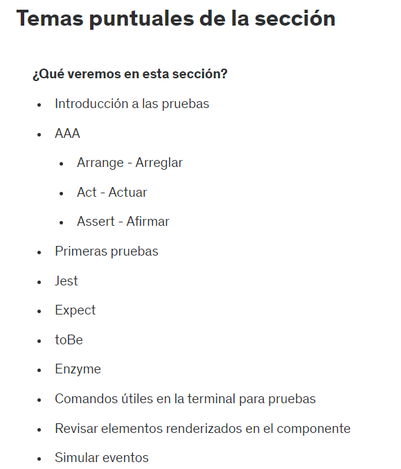

# 49. Introduccion a la seccion

# 50. Temas puntuales de la seccion



Esta sección de pruebas es sumamente importante porque nos dará la base de las pruebas que estaremos haciendo durante el curso, las pruebas irán creciendo en complejidad, por lo que les recomiendo que nos aseguremos de comprender bien todos estos conceptos para que nos sea más fácil las siguientes secciones de pruebas.

# 51. Introduccion a las pruebas unitarias y de integracion

¿Qué son las pruebas?

Las pruebas en el desarrollo de software son actividades esenciales para verificar que el código funciona correctamente y cumple con los requisitos especificados. Las pruebas ayudan a identificar y corregir errores antes de que el software se despliegue en producción, asegurando así su calidad y confiabilidad. Existen diferentes tipos de pruebas, cada una con un propósito específico.

¿Qué son las pruebas unitarias?
Las pruebas unitarias son un tipo de prueba que se centra en verificar el funcionamiento de componentes individuales del código, como funciones, métodos o clases, de manera aislada. El objetivo principal de las pruebas unitarias es asegurarse de que cada unidad de código funcione correctamente por sí sola. Características clave de las pruebas unitarias:

- Aislamiento: Las unidades se prueban de manera aislada del resto del sistema. Se utilizan técnicas como el mockeo (simulación de objetos) para aislar el código bajo prueba.
- Automatización: Generalmente, las pruebas unitarias se automatizan para permitir su ejecución frecuente y rápida.
- Cobertura: Ayudan a lograr una alta cobertura de código, asegurando que la mayoría de las líneas de código se prueben.

¿Qué son las pruebas de integración?
Las pruebas de integración se centran en verificar la interacción entre diferentes módulos o componentes del sistema. A diferencia de las pruebas unitarias, las pruebas de integración aseguran que las unidades de código trabajen juntas correctamente. Estas pruebas ayudan a identificar problemas en la forma en que los componentes interactúan y se comunican entre sí.

Características clave de las pruebas de integración:

Interacción: Evalúan la interacción entre múltiples componentes del sistema.
Detección de problemas: Ayudan a identificar problemas como errores de interfaz, dependencias incorrectas y problemas de comunicación entre componentes.
Complejidad: Generalmente, son más complejas que las pruebas unitarias debido a la necesidad de configurar y manejar múltiples componentes.

El patrón AAA (Arrange, Act, Assert) es una estructura comúnmente utilizada para escribir pruebas de software. Este patrón organiza el código de prueba en tres secciones claras y bien definidas, lo que ayuda a mejorar la legibilidad y el mantenimiento de las pruebas. A continuación se explica cada uno de estos pasos:

1. Arrange (Preparar)
En esta etapa, se configuran todas las condiciones necesarias para ejecutar la prueba. Esto puede incluir la creación de objetos, la inicialización de variables y la configuración de cualquier estado previo que el sistema necesite antes de realizar la acción que se va a probar.

2. Act (Actuar)
En este paso, se realiza la acción que se quiere probar. Esto generalmente implica llamar a una función o método del código bajo prueba con los datos de entrada necesarios.

3. Assert (Afirmar)
Finalmente, se verifica que el resultado de la acción es el esperado. Esto se hace mediante afirmaciones que comparan el resultado obtenido con el resultado esperado.

Ejemplo de Prueba Unitaria en JavaScript
Supongamos que tenemos una función sumar que queremos probar:

function sumar(a, b) {
  return a + b;
}

test('sumar debería retornar la suma de dos números', () => {
  // Arrange
  const num1 = 3;
  const num2 = 5;
  const resultadoEsperado = 8;

  // Act
  const resultado = sumar(num1, num2);

  // Assert
  expect(resultado).toBe(resultadoEsperado);
});

Mitos sobre las Pruebas de Software
1. Hacen que mi aplicación no tenga errores
Mito: Las pruebas aseguran que una aplicación esté completamente libre de errores.

Realidad: Las pruebas de software están diseñadas para encontrar errores, pero no pueden garantizar que todos los errores serán encontrados y corregidos. Incluso con un conjunto completo de pruebas unitarias, de integración y de extremo a extremo, siempre existe la posibilidad de que algunos errores pasen desapercibidos, especialmente en situaciones complejas o inesperadas. Las pruebas son una herramienta para mejorar la calidad y confiabilidad del software, pero no pueden garantizar la perfección.

2. Las pruebas no pueden fallar
Mito: Una vez que las pruebas están escritas, deberían pasar siempre y nunca fallar.

Realidad: Las pruebas pueden fallar por diversas razones. Los errores en el código, cambios en los requisitos, dependencias externas que cambian o se rompen, y errores en las propias pruebas pueden causar fallos. De hecho, la detección de fallos en las pruebas es una parte importante del proceso de desarrollo, ya que indica que algo en el sistema necesita atención. El objetivo de las pruebas es identificar y resolver estos problemas, no evitar que ocurran.

3. Hacen más lenta mi aplicación
Mito: La ejecución de pruebas hace que la aplicación se ejecute más lentamente.

Realidad: Las pruebas en sí no afectan el rendimiento de la aplicación en producción. Las pruebas se ejecutan en entornos de desarrollo o pruebas, y aunque la ejecución de un conjunto completo de pruebas puede llevar tiempo, esto no impacta directamente el rendimiento del software que se despliega a los usuarios finales. Sin embargo, el proceso de prueba puede ser optimizado para minimizar el tiempo que toma, utilizando técnicas como pruebas paralelas, pruebas basadas en riesgos y selección de pruebas.

4. Es una pérdida de tiempo
Mito: Escribir y mantener pruebas es una actividad que consume tiempo y no aporta suficiente valor.

Realidad: Las pruebas bien diseñadas y mantenidas pueden ahorrar tiempo a largo plazo al identificar errores temprano en el ciclo de desarrollo, lo que reduce el costo y el esfuerzo de corregir problemas más adelante. Además, las pruebas automatizadas permiten verificar rápidamente si los cambios en el código han introducido nuevos errores, facilitando el desarrollo continuo y la integración continua (CI). Si bien la escritura de pruebas requiere tiempo y esfuerzo inicial, el retorno de inversión en términos de calidad, confiabilidad y capacidad de mantenimiento del software es significativo.

5. Hay que probar todo
Mito: Es necesario probar cada línea de código y cada posible combinación de inputs y estados.

Realidad: Si bien tener una alta cobertura de pruebas es deseable, es impracticable y costoso intentar probar absolutamente todo. En lugar de eso, se deben priorizar las pruebas basadas en los riesgos, la importancia del código y las áreas críticas del sistema. Las pruebas unitarias, de integración y de extremo a extremo deben enfocarse en las partes más importantes y propensas a errores del software. La estrategia de prueba debe ser equilibrada, enfocándose en maximizar la cobertura y el valor de las pruebas sin incurrir en un costo desproporcionado.

# 52. Inicio de la seccion - Pruebas sobre lo aprendido anteriormente

# 53. Mi primera prueba y configuraciones iniciales


¿Qué es Jest?
Jest es un framework de pruebas en JavaScript, desarrollado y mantenido por Facebook, que se utiliza principalmente para probar aplicaciones desarrolladas con React. Sin embargo, es lo suficientemente versátil para ser utilizado con cualquier proyecto JavaScript.

https://jestjs.io/

https://jestjs.io/docs/getting-started

Paso 1: yarn add --dev jest: El comando yarn add --dev jest se utiliza para instalar Jest como una dependencia de desarrollo en tu proyecto.

Paso 2: Colocamos el script en package.json: "test": "jest"

  "scripts": {
    "dev": "vite",
    "build": "vite build",
    "lint": "eslint . --ext js,jsx --report-unused-disable-directives --max-warnings 0",
    "preview": "vite preview",
    "test": "jest"
  },

Paso 3: Poner en terminal yarn test

```js
test('Esta prueba no debe fallar', () => { 
    if (0 === 0) {
        throw new Error('No puede dividir entre cero');
    }
 })
```

El script "test": "jest --watchAll" en el archivo package.json se utiliza para ejecutar Jest en modo de observación. El modo de observación de Jest hace que el proceso de prueba se ejecute continuamente, observando los archivos en el proyecto. Siempre que se detecten cambios en los archivos, Jest vuelve a ejecutar las pruebas automáticamente. 

  "scripts": {
    "dev": "vite",
    "build": "vite build",
    "lint": "eslint . --ext js,jsx --report-unused-disable-directives --max-warnings 0",
    "preview": "vite preview",
    "test": "jest --watchAll"
  },

# 54. Jest - Expect - toBe

Ponemos en la terminal: yarn add -D @types/jest

El comando yarn add -D @types/jest es crucial cuando trabajas con TypeScript y Jest, ya que proporciona las definiciones de tipos necesarias para aprovechar al máximo las capacidades de TypeScript, como el autocompletado, la verificación de tipos y la documentación en el editor. Esto no solo mejora la experiencia de desarrollo, sino que también ayuda a prevenir errores comunes de tipado en tus pruebas.

En Jest, expect y toBe son parte del API de aserciones, utilizadas para comprobar si los valores de tu código coinciden con los valores esperados en tus pruebas. A continuación, te explico en detalle cómo se usan y qué significan.

- expect: La función expect se utiliza para envolver un valor que deseas probar. Este valor puede ser el resultado de una función, una variable, o cualquier valor que quieras verificar en tu prueba.

- toBe: El método toBe se utiliza para comparar el valor envuelto por expect con un valor esperado utilizando el operador de estricta igualdad (===). Esto significa que toBe verifica si ambos valores son exactamente iguales en tipo y contenido.

Ejemplo Basico:

// archivo suma.js
function suma(a, b) {
  return a + b;
}
module.exports = suma;


// archivo suma.test.js
const suma = require('./suma');

test('suma 1 + 2 para dar 3', () => {
  expect(suma(1, 2)).toBe(3);
});


```js
describe('Pruebas en <DemoComponent>', () => {
    test('Esta prueba no debe fallar', () => { 

        // 1. Inicializacion
        const message1 = 'Hola Mundo';
    
        // 2. Estimulo
        const message2 = message1.trim();
    
        // 3. Observar el comportamiento... esperado
        expect(message1).toBe(message2)
    
    })
});
```

# 55. Nota de Actualizacion - Extension de archivos

En la siguiente clase se hace la configuración para las pruebas de nuestros distintos archivos, en caso de ver el error "You appear to be using a native ECMAScript module configuration file, which is only supported when running Babel asynchronously."


Cambiar extensión de los archivos jest.config.js y babel.config.js a .cjs


Para ver mas detalles al respecto pueden ir a 
https://nodejs.org/docs/latest/api/modules.html#enabling.

# 56. Pruebas en el archivo 02 - template-string.js

El comando yarn add --dev babel-jest @babel/core @babel/preset-env se utiliza para configurar Babel junto con Jest en un proyecto JavaScript. Aquí te explico el propósito de cada paquete y el porqué de su uso:

- babel-jest: Integra Babel con Jest para transpilar el código de pruebas.
- @babel/core: Núcleo de Babel, necesario para la compilación de JavaScript moderno.
- @babel/preset-env: Configuración de Babel para usar las últimas características de JavaScript.

Estas herramientas en conjunto permiten a los desarrolladores escribir y probar código moderno de JavaScript de manera eficiente y efectiva.

Luego si creamos el proyecto con vite debemos crear un archivo babel.config.js:

```js
module.exports = {
    presets: [['@babel/preset-env', { targets: { node: 'current' } }]],
};
```

```js
export function getSaludo(nombre) {
    return 'Hola ' + nombre;
}
```

```js
import { getSaludo } from "../../src/base-pruebas/02-template-string";
describe('Pruebas en 02-template-string', () => {
    test('getSaludo debe retornar "Hola Fernando"', () => {
        const name = 'Fernando';
        const message = getSaludo(name);

        expect(message).toBe(`Hola ${name}`)
    })
})
```

# 57. toEqual

```js
import { getUser, getUsuarioActivo } from "../../src/base-pruebas/05-funciones";

describe('Pruebas en 05-funciones', () => {
    test('getUser debe retornar un objeto', () => {
        const testUser = {
            uid: 'ABC123',
            username: 'El_Papi1502'
        };
        const user = getUser();
        expect(testUser).toEqual(user)
    });

    test('getUsuarioActivo debe retornar un objeto', () => {
        const name = 'Fernando';

        const user = getUsuarioActivo(name);

        expect(user).toEqual({
            uid: 'ABC567',
            username: name
        })
    })
})
```

# 58. Pruebas en el archivo 07-deses-arr.js

```js
import { retornaArreglo } from "../../src/base-pruebas/07-deses-arr"

describe('Pruebas en 07-deses-arr', () => {
    test('debe de retornar un string y un numero', () => {
        const [letters, numbers] = retornaArreglo();
        expect(letters).toBe('ABC');
        expect(numbers).toBe(123);

        // primera forma
        expect(typeof letters).toBe('string')
        expect(typeof numbers).toBe('number')

        // segunda forma
        expect(letters).toEqual(expect.any(String))
    })
})
```

# 59. Pruebas en 08-imp-exp.js-Arreglos

```js
import { getHeroeById, getHeroesByOwner } from "../../src/base-pruebas/08-imp-exp";
import heroes from "../../src/data/heroes";

describe('Pruebas en 08-imp-exp', () => {
    test('getHeroeById debe de retornar un heroe por ID', () => {
        const id = 1;
        const hero = getHeroeById(id);
        expect(hero).toEqual({ id: 1, name: 'Batman', owner: 'DC' })
    });

    test('getHeroeById debe de retornar undefined si no existe ID', () => {
        const id = 100;
        const hero = getHeroeById(id);
        expect(hero).toBeFalsy();
    });

    //Tarea
    //1. 
    //Debe de retornar un arreglo con los heros de DC
    //Length===3
    //toEqual al arreglo filtrado

    //2.
    //debe de retornar un arreglo con los heroes de Marvel
    //length===2

    test('getHeroesByOwner debe de retornar un arreglo con los heros de DC', () => {
        const own = 'DC'
        const hero = getHeroesByOwner(own)
        expect(hero.length).toEqual(3)
    });

    test('getHeroesByOwner debe de retornar un arreglo con los heros de Marvel', () => {
        const own = 'Marvel'
        const hero = getHeroesByOwner(own)
        expect(hero.length).toBe(2)
        expect(hero).toEqual(heroes.filter( (heroe) => heroe.owner === own ));
    })
})
```

# 60. Pruebas con tareas asincronas

```js
import { getHeroeByIdAsync } from "../../src/base-pruebas/09-promesas";

describe('Pruebas en 09-promesas', () => {
    test('getHeroeByIdAsync debe de retornar un heroe', (done) => {
        const id = 1;
        getHeroeByIdAsync(id)
            .then(hero => {
                expect(hero).toEqual({
                    id: 1,
                    name: 'Batman',
                    owner: 'DC'
                });
                done();
            })
    })

    test('getHeroeByIdAsync debe de obtener un error si heroe no existe', (done) => {
        const id = 100;
        getHeroeByIdAsync(id)
            .catch(error => {
                expect(error).toBe(`No se pudo encontrar el héroe ${id}`)
                done();
            })
    })
})
```

done(): Se llama a esta función para indicar que la prueba ha terminado. Esto es necesario porque la prueba es asíncrona; done asegura que Jest (el marco de pruebas) sepa cuándo ha terminado la prueba.

# 61. Pruebas con async-await

```js
import { getImagen } from "../../src/base-pruebas/11-async-await"

describe('Pruebas en 11-async-await', () => {
    test('getImagen debe de retornar un URL de la imagen', async () => {
        const url = await getImagen();
        expect(typeof url).toBe('string')
    })
})
```

Adicionalmente, si nos marca error esa prueba (suele suceder en versiones anteriores a node 18) podemos configurar algunas cosas

Creamos el archivo jest.config.cjs
```js
module.exports = {
    // TODO: jsdom,
    setupFiles: ['./jest.setup.js']
}
```

Creamos el archivo jest.setup.js
```js
import 'whatwg-fetch';
```

# 62. Evaluar el Catch en el async-await

Si borramos el API key y hacemos la prueba: 

```js
test('getImagen debe de retornar un error si no tenemos API key', async () => {
        const resp = await getImagen();
        expect(resp).toBe('No se encontro la imagen')
    })
```

# 63. Pruebas sobre componentes de React

https://jestjs.io/docs/getting-started
https://testing-library.com/

Trabajar con Jest y React Testing Library juntos es conveniente por varias razones:

1. Compatibilidad y Facilidad de Uso:
Jest es un framework de pruebas de JavaScript que viene con un conjunto de características poderosas para realizar pruebas unitarias, de integración y de extremo a extremo. Es fácil de configurar y usar con React.
React Testing Library está diseñada específicamente para probar componentes de React de manera que se enfoquen en cómo los usuarios interactúan con la interfaz. Se integra perfectamente con Jest, lo que hace que la configuración sea sencilla.
2. Pruebas Basadas en la Interacción del Usuario:
React Testing Library fomenta las pruebas basadas en la interacción del usuario, lo cual es una práctica recomendada para asegurar que los componentes funcionan correctamente desde la perspectiva del usuario.
En lugar de probar la implementación interna de los componentes, se centra en cómo los componentes se comportan en situaciones del mundo real.
3. Asincronía Simplificada:
Jest tiene un excelente soporte para pruebas asíncronas, permitiendo el uso de promesas, async/await y funciones de callback (done).
React Testing Library complementa esto proporcionando utilidades como waitFor y findBy, que facilitan la espera de cambios en la interfaz de usuario, como la aparición o desaparición de elementos.
4. Buenas Prácticas y Mejor Mantenimiento:
React Testing Library promueve buenas prácticas al desalentar pruebas que dependan del estado interno o la implementación de los componentes. Esto hace que las pruebas sean más robustas y menos propensas a fallar debido a cambios internos en el código.
El enfoque en pruebas basadas en la interacción del usuario también asegura que las pruebas sean más fáciles de mantener y que reflejen mejor el comportamiento esperado de la aplicación.
5. Funciones y API Potentes:
Jest ofrece características como mocks, spies, temporizadores, snapshots, y más, que son muy útiles para una amplia gama de casos de prueba.
React Testing Library proporciona métodos intuitivos para seleccionar y verificar elementos en el DOM, como getByText, getByRole, getByLabelText, entre otros, que son más resistentes a los cambios en el código.

Para usar react testing library si usamos vite: yarn add --dev @testing-library/react

# 64. Pruebas en FirstApp - Componentes de React

```js
//Archivo jest.config.cjs
module.exports = {
    testEnvironment: 'jest-environment-jsdom',
    setupFiles: ['./jest.setup.js']
}
```

```js
// Archivo babel.config.cjs
module.exports = {
    presets: [
        ['@babel/preset-env', {targets: {esmodules: true}}],
        ['@babel/preset-react', {runtime: 'automatic'}],
    ],
};
```

```js
import { FirstApp } from "../src/FirstApp"
import { render } from "@testing-library/react";

describe('Pruebas en FirstApp', () => {
    test('Debe de hacer match con el snapshot', () => {
        const title = 'Hola, Soy Gokuuuu'; 
         render(<FirstApp title={title} />)
    })
})
```

# 65. Probar FirstApp

- render es una función de React Testing Library que renderiza el componente FirstApp con la prop title que hemos definido.
- render devuelve un objeto que incluye, entre otras cosas, container, que contiene el HTML renderizado del componente.
- expect es una función de Jest para realizar aserciones. En este caso, se espera que container coincida con el snapshot.
- toMatchSnapshot es un matcher de Jest que compara el HTML renderizado con un snapshot previamente guardado. Si no existe un snapshot, Jest creará uno nuevo y lo guardará. Si existe, Jest comparará el HTML actual con el snapshot existente.

*¿Qué es un Snapshot?*

Un snapshot es una representación de la salida renderizada de un componente en un momento específico. Esencialmente, captura el estado del componente y lo guarda en un archivo de snapshot. Este archivo se guarda en una carpeta __snapshots__ junto al archivo de prueba.

*¿Por qué usar Snapshots?*
1. Detección de Cambios No Intencionales: Los snapshots son útiles para detectar cambios no intencionales en el componente. Si se modifica el componente de una manera que cambia su salida HTML, la comparación de snapshots fallará, alertándote del cambio.

2. Documentación: Los snapshots también actúan como una forma de documentación, mostrando cómo se supone que debe renderizarse un componente con ciertas props.

*Flujo de Trabajo con Snapshots*

1. Primera Ejecución: En la primera ejecución de la prueba, Jest creará un archivo de snapshot si no existe. Este archivo contendrá la salida renderizada del componente.

2. Ejecuciones Posteriores: En ejecuciones posteriores, Jest comparará la salida renderizada actual del componente con el snapshot existente. Si hay discrepancias, la prueba fallará, indicando que ha habido un cambio en la salida del componente.

3. Actualización de Snapshots: Si los cambios en la salida del componente son intencionales y correctos, puedes actualizar los snapshots ejecutando Jest con la opción --updateSnapshot (o -u).

```js
import { FirstApp } from "../src/FirstApp"
import { render } from "@testing-library/react";

describe('Pruebas en FirstApp', () => {
    test('Debe de hacer match con el snapshot', () => {
        const title = 'Hola, Soy Goku';
        const {container} = render(<FirstApp title={title} />)
        expect(container).toMatchSnapshot();
    });

    test('Debe de mostrar el titulo en un h1', () => {
        const title = 'Hola, soy Goku';
        const {container, getByText} = render(<FirstApp title={title} />)
        expect(getByText(title)).toBeTruthy();
        const h1 = container.querySelector('h1');
        expect(h1.innerHTML).toContain(title)
    })
})
```

Para el segundo test:

Esta prueba está diseñada para verificar que el componente FirstApp muestra el título en un elemento h1.

- render es una función de React Testing Library que renderiza el componente FirstApp con la prop title que hemos definido.

- render devuelve un objeto que incluye, entre otras cosas, container, que contiene el HTML renderizado del componente, y getByText, una función para seleccionar elementos por su contenido de texto.

- getByText(title) selecciona el elemento que contiene el texto igual a title. Si encuentra el elemento, lo devuelve; de lo contrario, lanza un error.

- expect(...).toBeTruthy() verifica que el elemento seleccionado por getByText existe en el DOM. Si getByText no encuentra el texto, la prueba fallará.

- container.querySelector('h1') selecciona el primer elemento h1 dentro del contenedor del componente renderizado.

- expect(h1.innerHTML).toContain(title) verifica que el contenido HTML del elemento h1 contiene el texto title. Si el h1 no contiene el texto, la prueba fallará.

*¿Qué Hace Esta Prueba?*

1. Renderiza el componente FirstApp con una prop title igual a 'Hola, soy Goku'.
2. Verifica que el texto 'Hola, soy Goku' aparece en el DOM utilizando getByText.
3. Selecciona el primer elemento h1 en el contenedor renderizado.
4. Verifica que el elemento h1 contiene el texto 'Hola, soy Goku'.

*¿Por Qué Es Útil Esta Prueba?*

- Confirma que el componente muestra el título: Esta prueba asegura que el componente FirstApp renderiza correctamente el texto del título en el DOM.

- Verifica la estructura del DOM: La prueba verifica específicamente que el título se muestra dentro de un elemento h1, lo cual es importante para mantener la estructura y semántica HTML correcta.

- Ayuda a detectar regresiones: Si alguien accidentalmente cambia la estructura del componente o el nombre de la etiqueta donde se muestra el título, esta prueba fallará, alertando sobre el cambio.

# 66. getByTestId y otras props

```js
test('debe de mostrar el subtitulo enviado por props', () => {
        const title = 'Hola, soy Goku';
        const subTitle = 'Soy un subtitulo';
        const { getByText } = render(
            <FirstApp
                title={title}
                subTitle={subTitle}
            />)
        expect(getByText(subTitle)).toBeTruthy();
    })
```

- Aquí se definen dos constantes: title con el valor 'Hola, soy Goku' y subTitle con el valor 'Soy un subtitulo'. Estas constantes se utilizarán como props para el componente FirstApp.

- render es una función de React Testing Library que renderiza el componente FirstApp con las props title y subTitle que hemos definido.

- render devuelve un objeto que incluye, entre otras cosas, getByText, una función para seleccionar elementos por su contenido de texto.

- getByText(subTitle) selecciona el elemento que contiene el texto igual a subTitle. Si encuentra el elemento, lo devuelve; de lo contrario, lanza un error.

- expect(...).toBeTruthy() verifica que el elemento seleccionado por getByText existe en el DOM. Si getByText no encuentra el texto, la prueba fallará.

# 67. Screen - Testing Library

```js
import { FirstApp } from "../src/FirstApp"
import { render, screen } from "@testing-library/react";

describe('Pruebas en FirstApp', () => {
    const title = 'Hola, soy goku';
    const subTitle = 'Soy un subtitulo';

    test('debe de hacer match con el snapshot', () => {
        const { container } = render(<FirstApp title={title} />);
        expect(container).toMatchSnapshot();
    });


    /*
    Esta prueba está diseñada para verificar que el componente FirstApp muestra el mensaje pasado como prop en algún lugar del DOM.
    - render es una función de React Testing Library que renderiza el componente FirstApp con la prop title que hemos definido.
    - En este contexto, title debe ser una variable definida anteriormente en el archivo de prueba con el valor 'Hola, soy Goku'.
    - screen es un objeto de React Testing Library que proporciona acceso al DOM renderizado. Se usa para seleccionar elementos de la interfaz de usuario.
    - getByText(title) selecciona el elemento que contiene el texto igual a title. Si encuentra el elemento, lo devuelve; de lo contrario, lanza un error.
    - expect(...).toBeTruthy() verifica que el elemento seleccionado por getByText existe en el DOM. Si getByText no encuentra el texto, la prueba fallará.
    */
    test('debe de mostrar el mensaje "Hola, soy goku"', () => {
        render(<FirstApp title={title} />);
        expect(screen.getByText(title)).toBeTruthy();
    });

    /*
    Esta prueba está diseñada para verificar que el componente FirstApp muestra el título pasado como prop en un elemento h1.
    - render es una función de React Testing Library que renderiza el componente FirstApp con la prop title que hemos definido.
    - Este paso renderiza el componente en un contenedor DOM virtual para pruebas.
    - screen es un objeto de React Testing Library que proporciona acceso al DOM renderizado. Se usa para seleccionar elementos de la interfaz de usuario.
    - getByRole('heading', { level: 1 }) selecciona el elemento h1 en el DOM, ya que los elementos h1 tienen el rol de "heading" (encabezado) con nivel 1.
    - innerHTML devuelve el contenido HTML del elemento seleccionado.
    - expect(...).toContain(title) verifica que el contenido HTML del elemento h1 contiene el texto title. Si el h1 no contiene el texto, la prueba fallará.
    */
    test('debe de mostrar el titulo en un h1', () => {
        render(<FirstApp title={title} />);
        expect(screen.getByRole('heading', { level: 1 }).innerHTML).toContain(title);
    });

    /*
    Esta prueba está diseñada para verificar que el componente FirstApp muestra el subtítulo que se le pasa a través de las props, y que este subtítulo aparece dos veces en el DOM.
    - render es una función de React Testing Library que renderiza el componente FirstApp con las props title y subTitle que hemos definido.
    - Este paso renderiza el componente en un contenedor DOM virtual para pruebas.
    - screen es un objeto de React Testing Library que proporciona acceso al DOM renderizado. Se usa para seleccionar elementos de la interfaz de usuario.
    - getAllByText(subTitle) selecciona todos los elementos que contienen el texto igual a subTitle.
    - .length devuelve el número de elementos encontrados que contienen el subtítulo.
    - expect(...).toBe(2) verifica que la cantidad de elementos encontrados es exactamente 2. Si no se encuentran exactamente dos elementos con el subtítulo, la prueba fallará.
    */
    test('debe de mostrar el subtitulo enviado por props', () => {
        render(
            <FirstApp
                title={title}
                subTitle={subTitle}
            />
        );
        expect(screen.getAllByText(subTitle).length).toBe(2);
    })
})
```

# 68. Pruebas básicas del CounterApp

```js
// tarea
// Pruebas en el <CounterApp />
// test: debe de hacer match con el snapshot
// test: debe de mostrar el valor inicial de 100 <CounterApp value={100}>

import { CounterApp } from "../src/CounterApp"
import { render, screen } from '@testing-library/react'

describe('Haciendo pruebas en el archivo CounterApp', () => {
    const value = 10;

    test('debe de hacer match con el snapshot', () => {
        const {container} = render(< CounterApp value={value}/>)
        expect(container).toMatchSnapshot();
    });

    test('debe de mostrar el valor inicial de 100 <CounterApp value={100}>', () => { 
         render(<CounterApp value={100}/>)
         expect(screen.getByText(100)).toBeTruthy();
        //  expect(screen.getByRole('heading', {level: 2}).innerHTML).toContain('100');
    })
})
```

# 69. Simular eventos - Click

```js
import { CounterApp } from "../src/CounterApp"
import { fireEvent, render, screen } from '@testing-library/react'

describe('Haciendo pruebas en el archivo CounterApp', () => {
    const value = 10;

    test('debe de incrementar con el boton +1', () => { 
        render(<CounterApp value={value}/>) ;
        fireEvent.click(screen.getByText('+1'));
        expect(screen.getByText('11')).toBeTruthy();
    });

    test('debe de decrementar con el boton -1', () => { 
        render(<CounterApp value={value}/>) ;
        fireEvent.click(screen.getByText('-1'));
        expect(screen.getByText('9')).toBeTruthy();
    });

    test('debe de funcionar el boton de reset', () => { 
        render(<CounterApp value={value}/>) ;
        fireEvent.click(screen.getByText('+1'));
        fireEvent.click(screen.getByText('+1'));
        fireEvent.click(screen.getByText('+1'));

        // Primera forma
        // fireEvent.click(screen.getByText('Reset'));
        // expect(screen.getByText(value)).toBeTruthy();

        // Segunda forma
        fireEvent.click(screen.getByRole('button', {name: 'btn-reset'}));
        expect(screen.getByText(value)).toBeTruthy();
    })
})
```

# 70. Codigo fuente de la seccion

Aquí les dejo el código fuente de la sección por si lo llegan a necesitar y comparar contra el suyo:

https://github.com/Klerith/react-vite-counter-app/tree/fin-seccion-5