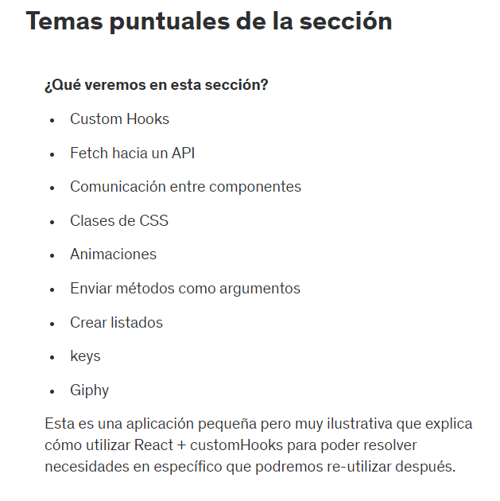
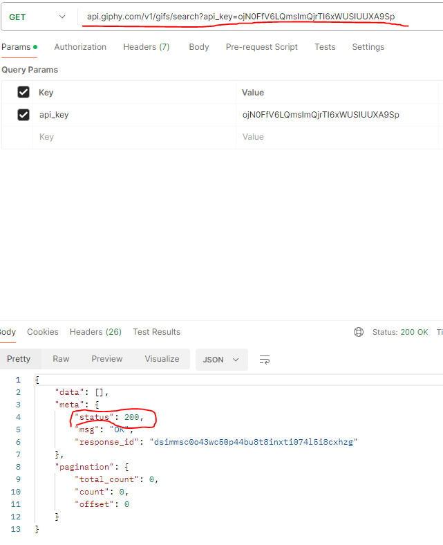
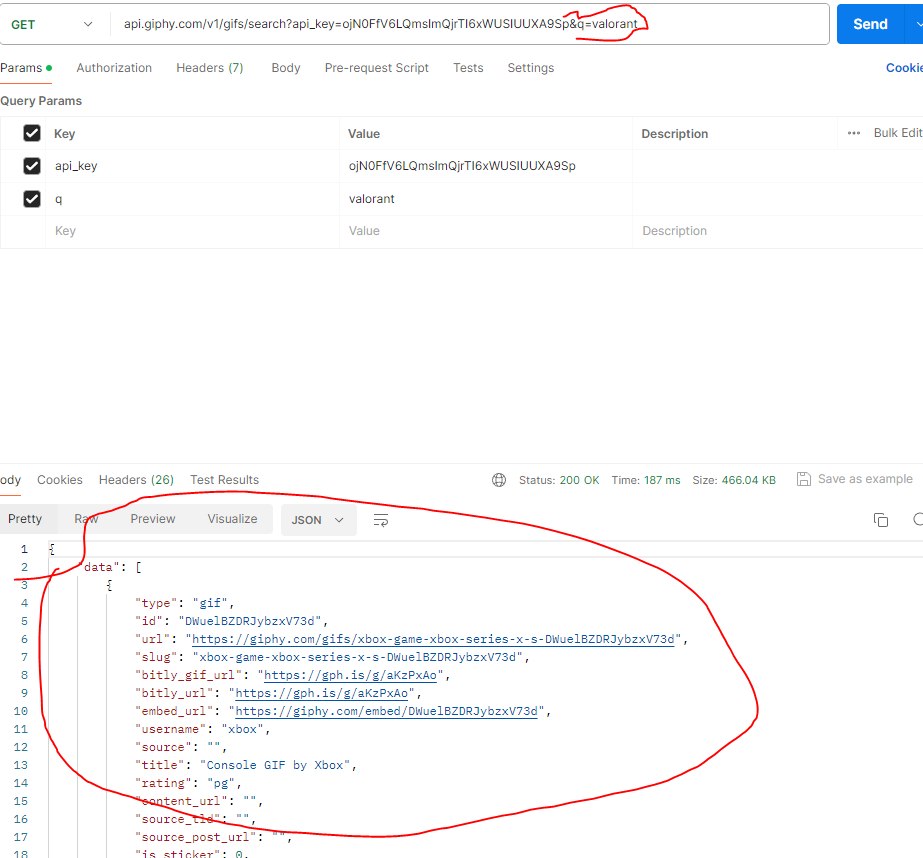
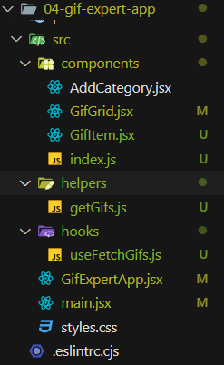

# 71. Introduccion a la seccion

# 72. Temas puntuales de la seccion



# 73. Resultado al final de la seccion

# 74. Inicio de proyecto GifExpertApp

```jsx
// Archivo GifExpertApp.jsx
export const GifExpertApp = () => {
    return (
        <>
            <h1>GifExpertApp</h1>
        </>
    )
}
```

```jsx
// Archivo main.jsx
import React from 'react'
import ReactDOM from 'react-dom/client'
import { GifExpertApp } from './GifExpertApp'

ReactDOM.createRoot(document.getElementById('root')).render(
  <React.StrictMode>
    <GifExpertApp />
  </React.StrictMode>,
)
```

# 75. GiftExpertApp - Component

Recursos compartidos: 
- https://gist.github.com/Klerith/e4fca6ac127ccb9abd1e8ad77fcd52f1
- https://hackernoon.com/structuring-projects-and-naming-components-in-react-1261b6e18d76
- https://es.legacy.reactjs.org/docs/faq-structure.html

```jsx
// Archivo main.jsx
import React from 'react'
import ReactDOM from 'react-dom/client'
import { GifExpertApp } from './GifExpertApp'
import './styles.css';

ReactDOM.createRoot(document.getElementById('root')).render(
  <React.StrictMode>
    <GifExpertApp />
  </React.StrictMode>,
)
```

```css
/*Archivo styles.css*/
* {
    font-family: Helvetica, Arial, sans-serif;
    background-color: rgb(234, 234, 234);
  }
  
  body {
    padding: 60px;
  }
  
  input {
    background-color: white;
    border-radius: 5px;
    border: 1px solid rgb(97, 32, 158);
    color: black;
    font-size: 1.2rem;
    outline: none;
    padding: 10px 15px;
    width: 100%;
  }
  
  h2 {
    font-size: 1.5rem;
  }
  
  h3 {
    font-size: 3rem;
    margin-bottom: 5px;
  }
  
  .card-grid {
    display: flex;
    flex-direction: row;
    flex-wrap: wrap;
    justify-content: center;
  }
  
  .card {
    align-content: center;
    align-items: center;
    background-color: white;
    border-radius: 10px;
    box-shadow: 0px 3px 5px rgba(0, 0, 0, 0.03);
    display: flex;
    flex-direction: column;
    height: 0%;  
    justify-content: center;
    margin-bottom: 20px;
    margin-right: 20px;
    overflow: hidden;
  }
  
  .card p {
    background-color: white;
    flex: 1;
    font-size: 1.5rem;
    margin-top: 5px;
    padding: 5px 20px 0px 20px;
    text-align: center;
  }
  
  .card img {
    width: 100%;
  }
```

# 76. Creando una lista de categorias

```js
import { useState } from "react";

export const GifExpertApp = () => {
    const [categories, setCategories] = useState(['One Punch', 'Dragon Ball Z']);
    console.log(categories);
    return (
        <>
            {/* titulo */}
            <h1>GifExpertApp</h1>

            {/* Listado de Gif */}
            <ol>
                {
                    categories.map(category => {
                        return <li key={category}>{category}</li>
                    })
                }
            </ol>

            {/* Gif Item */}
        </>
    )
}
```

# 77. Agregando una nueva categoria

```jsx
import { useState } from "react";

export const GifExpertApp = () => {
    const [categories, setCategories] = useState(['One Punch', 'Dragon Ball Z']);
    const onAddCategory = () => {
        const newCategory = prompt('Ingrese una nueva categoria');
        setCategories([newCategory, ...categories])
    }
    return (
        <>
            {/* titulo */}
            <h1>GifExpertApp</h1>


            {/* Listado de Gif */}
            <button onClick={onAddCategory}>Agregar</button>
            <ol>
                {
                    categories.map(category => {
                        return <li key={category}>{category}</li>
                    })
                }
            </ol>

            {/* Gif Item */}
        </>
    )
}
```

# 78. Componente AddCategory

```jsx
// Archivo AddCategory.jsx
import { useState } from "react"

export const AddCategory = () => {
    const [inputValue, setinputValue] = useState('One Punch')
    
    const onInputChange = ({ target }) => {
        setinputValue(target.value);
    }

    const onSubmit = (event) => {
        event.preventDefault();
        console.log(inputValue);
    } 

    return (
        <form onSubmit={(event) => onSubmit(event)}>
            <input
                type="text"
                placeholder="Buscar Gifs"
                value={inputValue}
                onChange={onInputChange}
            />
        </form>
    )
}

```

# 79. Comunicacion entre componentes

```jsx
// Archivo AddCategory.jsx
import { useState } from "react"

export const AddCategory = ({ setCategories }) => {
    const [inputValue, setinputValue] = useState('')

    const onInputChange = ({ target }) => {
        setinputValue(target.value);
    }

    const onSubmit = (event) => {
        event.preventDefault();
        if(inputValue.trim().length <= 1) return;
        setCategories(categories => [inputValue, ...categories])
        setinputValue('')
    }

    return (
        <form onSubmit={onSubmit}>
            <input
                type="text"
                placeholder="Buscar Gifs"
                value={inputValue}
                onChange={onInputChange}
            />
        </form>
    )
}
```

```jsx
// Archivo GifExpertApp.jsx
import { useState } from "react";
import { AddCategory } from "./components/AddCategory";

export const GifExpertApp = () => {
    const [categories, setCategories] = useState(['One Punch', 'Dragon Ball Z']);
    const onAddCategory = () => {
        const newCategory = prompt('Ingrese una nueva categoria');
        setCategories([newCategory, ...categories])
    }
    return (
        <>
            {/* titulo */}
            <h1>GifExpertApp</h1>

            {/* Input */}
            <AddCategory setCategories = {setCategories}/>

            {/* Listado de Gif */}
            <ol>
                {
                    categories.map(category => {
                        return <li key={category}>{category}</li>
                    })
                }
            </ol>

            {/* Gif Item */}
        </>
    )
}
```

# 80. Emitir un evento al padre

```jsx
// Archivo GifExpertApp.jsx
import { useState } from "react";
import { AddCategory } from "./components/AddCategory";

export const GifExpertApp = () => {
    const [categories, setCategories] = useState(['One Punch', 'Dragon Ball Z']);
    
    const onAddCategory = (newCategory) => {
        setCategories([newCategory, ...categories])
    }
    return (
        <>
            {/* titulo */}
            <h1>GifExpertApp</h1>

            {/* Input */}
            <AddCategory
                onNewCategory={onAddCategory}
            />

            {/* Listado de Gif */}
            <ol>
                {
                    categories.map(category => {
                        return <li key={category}>{category}</li>
                    })
                }
            </ol>

            {/* Gif Item */}
        </>
    )
}
```

```jsx
// Archivo AddCategory.jsx
import { useState } from "react"

export const AddCategory = ({ onNewCategory }) => {
    const [inputValue, setinputValue] = useState('')

    const onInputChange = ({ target }) => {
        setinputValue(target.value);
    }

    const onSubmit = (event) => {
        event.preventDefault();
        if (inputValue.trim().length <= 1) return;
        onNewCategory(inputValue.trim());
        setinputValue('')
    }

    return (
        <form onSubmit={onSubmit}>
            <input
                type="text"
                placeholder="Buscar Gifs"
                value={inputValue}
                onChange={onInputChange}
            />
        </form>
    )
}
```

# 81. Validar que sean unicos los nombres

# 82. GifGrid - Nuevo componente

```jsx
import { useState } from "react";
import { AddCategory } from "./components/AddCategory";
import { GifGrid } from "./components/GifGrid";

export const GifExpertApp = () => {
    const [categories, setCategories] = useState(['One Punch', 'Dragon Ball Z']);

    const onAddCategory = (newCategory) => {
        if (categories.includes(newCategory)) return;
        setCategories([newCategory, ...categories])
    }
    return (
        <>
            <h1>GifExpertApp</h1>

            <AddCategory
                onNewCategory={onAddCategory}
            />

            {
                categories.map((category =>
                    <GifGrid key={category} category={category} />
                ))
            }

        </>
    )
}
```

```jsx
export const GifGrid = ({ category }) => {
    return (
        <>
            <h3>{category}</h3>
            <p>Hola Mundo</p>
        </>
    )
}
```

# 83. Fetch API - Obtener las imagenes deseadas

Este endpoint te permite acceder instantáneamente a la biblioteca de millones de GIFs y stickers de Giphy introduciendo una palabra o frase. 

https://developers.giphy.com/docs/api/endpoint#trending

Para probarlo usaremos postman:



Ahora agregando un parametro q con &q para buscar el gift que deseamos



```jsx
import { getGifs } from "../helpers/getGifs";

export const GifGrid = ({ category }) => {
    getGifs(category);

    return (
        <>
            <h3>{category}</h3>
        </>
    )
}
```

```js
export const getGifs = async(category) => {
    const url = `https://api.giphy.com/v1/gifs/search?api_key=ojN0FfV6LQmsImQjrTI6xWUSIUUXA9Sp&q=${category}&limit=20`;
    const resp = await fetch(url);
    const {data} = await resp.json();

    const gifs = data.map(img => ({
        id: img.id,
        title: img.title,
        url: img.images.downsized_medium.url
    }));

    console.log(gifs);
    return gifs;
}
```

# 84. useEffect
# 85. Demostracion de produccion rapido
# 86. Mostrar los titulos de las imagenes
# 87. className - Clases de css
# 88. Custom Hook - useFetchGifs
# 89. Mostrar mensajes de carga
# 90. Archivos de barril



```jsx
// Archivo main.jsx
import React from 'react'
import ReactDOM from 'react-dom/client'
import { GifExpertApp } from './GifExpertApp'
import './styles.css';

ReactDOM.createRoot(document.getElementById('root')).render(
  <React.StrictMode>
    <GifExpertApp />
  </React.StrictMode>
)
```

```jsx
// Archivo GifExpertApp.jsx
import { useState } from "react";
import { AddCategory, GifGrid } from "./components";

export const GifExpertApp = () => {
    const [categories, setCategories] = useState(['One Punch']);

    const onAddCategory = (newCategory) => {
        if (categories.includes(newCategory)) return;
        setCategories([newCategory, ...categories])
    }
    return (
        <>
            <h1>GifExpertApp</h1>

            <AddCategory
                onNewCategory={onAddCategory}
            />

            {
                categories.map((category =>
                    <GifGrid key={category} category={category} />
                ))
            }

        </>
    )
}
```

```jsx
//Archivo AddCategory.jsx
import { useState } from "react"

export const AddCategory = ({ onNewCategory }) => {
    const [inputValue, setinputValue] = useState('')

    const onInputChange = ({ target }) => {
        setinputValue(target.value);
    }

    const onSubmit = (event) => {
        event.preventDefault();
        if (inputValue.trim().length <= 1) return;
        onNewCategory(inputValue.trim());
        setinputValue('')
    }

    return (
        <form onSubmit={onSubmit}>
            <input
                type="text"
                placeholder="Buscar Gifs"
                value={inputValue}
                onChange={onInputChange}
            />
        </form>
    )
}
```

```jsx
// Archivo GifGrid.jsx
import { GifItem } from "./GifItem";
import { useFetchGifs } from "../hooks/useFetchGifs";

export const GifGrid = ({ category }) => {
    const {images, isLoading} = useFetchGifs(category);

    return (
        <>
            <h3>{category}</h3>
            {
                isLoading && (<h2>Cargando...</h2>)
            }
            <div className="card-grid">
                {
                    images.map((image) => (
                        <GifItem key={image.id} {...image} />
                    ))
                }
            </div>
        </>
    )
}
```

```jsx
// Archivo GifItem.jsx

export const GifItem = ({ title, url }) => {
    return (
        <div className="card">
            
            <p>{title}</p>
        </div>
    )
}
```

```js
// Archivo getGifs.js
export const getGifs = async(category) => {
    const url = `https://api.giphy.com/v1/gifs/search?api_key=ojN0FfV6LQmsImQjrTI6xWUSIUUXA9Sp&q=${category}&limit=10`;
    const resp = await fetch(url);
    const {data} = await resp.json();

    const gifs = data.map(img => ({
        id: img.id,
        title: img.title,
        url: img.images.downsized_medium.url
    }));

    return gifs;
}
```

```js
// Archivo useFetchGifs.js
import { useEffect, useState } from "react";
import { getGifs } from "../helpers/getGifs";

export const useFetchGifs = (category) => {
    const [images, setImages] = useState([]);
    const [isLoading, setIsLoading] = useState(true);
    const getImages = async () => {
        const newImages = await getGifs(category);
        setImages(newImages);
        setIsLoading(false);
    }
    useEffect(() => {
        getImages();
    }, []);
    return {
        images,
        isLoading
    }
}
```

```js
// Archivo index.js
export * from "./AddCategory";
export * from "./GifGrid";
export * from "./GifItem";
```

# 91. Codigo fuente de la seccion

https://github.com/Klerith/react-vite-gif-expert/tree/fin-seccion-6


