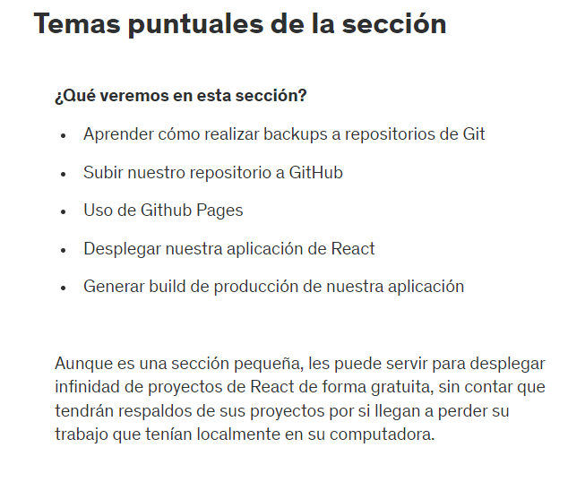
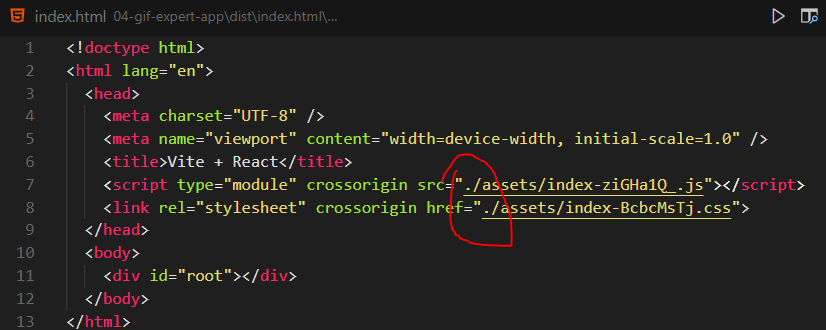
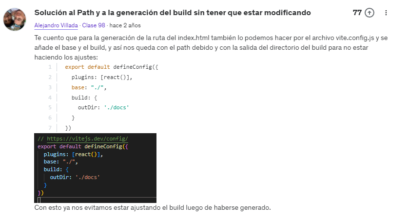
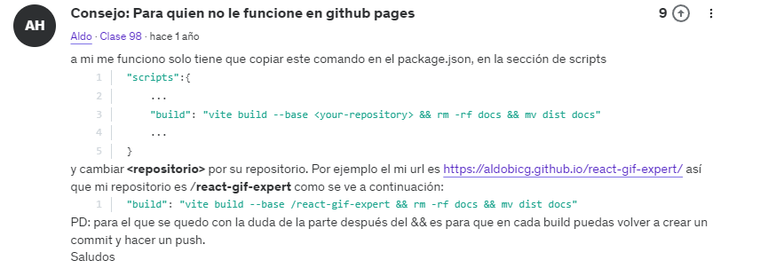

# 92. Introduccion a la seccion

# 93. Temas puntuales de la seccion

# 94. Desplegar en Netlify

1. Nos fijamos que nuestra app funcione correctamente
2. Ejecutamos yarn build. Ahi se generara la carpeta dist
3. Nos vamos https://www.netlify.com/ y nos logueamos
4. Tomamos nuestra carpeta dist, y dentro de la seccion de Sites de Netlify llevamos solo nuestra carpeta dist en la parte donde dice "or deploy manually"
5. Listo, ya esta subido. Ahora podemos visualizar a traves del enlace generado
6. Si queremos cambiarle el dominio buscamos la opcion "Change site name"
7. Este es nuestro enlace personalizado: https://walternicksuelarroyo-gifexpert.netlify.app/

# 95. Preparacion del proyecto - GitHub Pages

Imaginemos que borremos algunos archivos o lineas de codigo de casualidad y donde ya no podemos retornar a ello. Para ello podemos usar el comendo:

*git checkout -- .*

# 96. Subir a GitHub

1. Una vez realizado el git init, git add, git commit a nuestro proyecto nos vamos a github y creamos un repositorio
2. Le ponemos un nombre al proyecto y no tocamos nada mas, simplemente le damos en "crear repositorio"
3. Como ye tenemos el repositorio local simplemente ejecutamos

- git remote add origin http://github.com/.....
- git branch -M main
- git push -u origin main 

4. Con ello ya tendriamos subido el proyecto a github
5. Opcionalmente, en la raiz del proyecto crearemos un archivo README.md y escribimos lo que queremos, como una descripcion, una explicacion de como poder ejecutar la aplicacion, etc.
6. Luego como se agrego este archivo hacemos nuevamente git add ., git commit, y por ultimo solo ponemos git push

# 97. Desplegando aplicacion en GitHub Pages

1. Nuestra carpeta dist(que fue generada con yarn build) la vamos a renombrar con el nombre "docs"
2. Como se modifico el nombre hacemos el git add, git commit, y git push
3. Nos vamos a github, luego a configuracion, luego a page, elegimos la rama main y por ultimo seleccionamos la carpeta/folder docs
4. Le damos clic en save
5. Lo mas probable es que nos arroje errores en consola y no nos permita visualizar nuestro proyecto, la cual se solucionara la proxima clase

# 98. Actualizar GitHub pages

Para arreglar el problema, dentro de nuestra carpeta docs abrimos el archivo index.html y simplemente agregamos un "." a los archivos que nos marcan error.

Luego volvemos a ejecutar git add, commit, push. Con ello ya tendriamos el proyecto corriendo bien

Otras alternativas:

Cómo subir tu proyecto Vite a Github Pages de la forma más fácil: https://www.youtube.com/watch?v=ZI7MXe-6HzA

