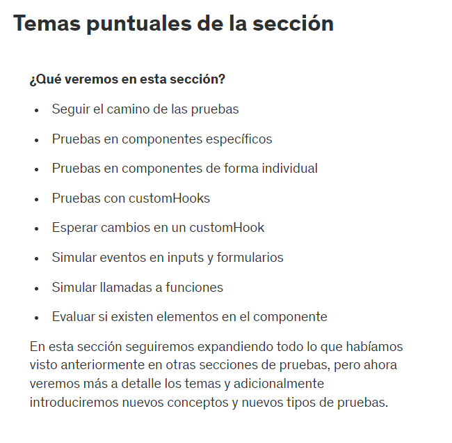
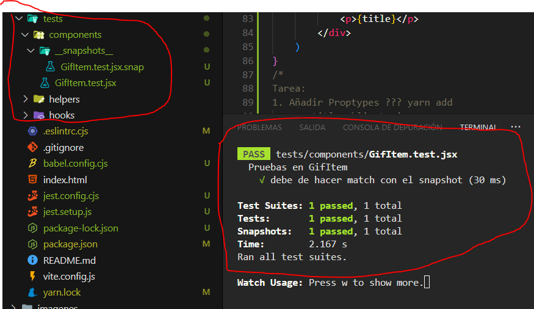

# SECCION 8: TESTING - PROBANDO LA APLICACION DE GITEXPERT

# 99. Introduccion a la seccion

# 100. Temas puntuales de la seccion



# 101. Configurar el ambiente de pruebas

Para poder configurar el ambiente de pruebas en Vite nos podemos guiar de lo siguiente (https://gist.github.com/Klerith/ca7e57fae3c9ab92ad08baadc6c26177)

*Instalación y configuracion de Jest + React Testing Library*

*En proyectos de React + Vite*

*1. Instalaciones:*

yarn add --dev jest babel-jest @babel/preset-env @babel/preset-react 

yarn add --dev @testing-library/react @types/jest jest-environment-jsdom

*2. Opcional: Si usamos Fetch API en el proyecto:*

yarn add --dev whatwg-fetch

*3. Actualizar los scripts del package.json*

"scripts: {
  ...
  "test": "jest --watchAll"

*4. Crear la configuración de babel babel.config.js*

module.exports = {
    presets: [
        [ '@babel/preset-env', { targets: { esmodules: true } } ],
        [ '@babel/preset-react', { runtime: 'automatic' } ],
    ],
};

*5. Opcional, pero eventualmente necesario, crear Jest config y setup:*

jest.config.js

module.exports = {
    testEnvironment: 'jest-environment-jsdom',
    setupFiles: ['./jest.setup.js']
}

jest.setup.js

// En caso de necesitar la implementación del FetchAPI
import 'whatwg-fetch'; // <-- yarn add whatwg-fetch

Ejecutamos el proyecto para ver si todo esta bien con yarn dev

Luego entramos al modo de testing con yarn test

*ERRORES*

- Al ejecutar el yarn test nos dara errores, por lo que la solucion solo seria lo siguiente:

cambiarle la extensión al jest.config.js a jest.config.cjs, también el babel.config.js a babel.config.cjs y ejecutar el comando yarn add -D jest-environment-jsdom

Con ello ya solucionariamos el problema. En caso se siga con el problema visitar la pagina del gist de fernando herrrera (https://gist.github.com/Klerith/ca7e57fae3c9ab92ad08baadc6c26177)

# 102. Implementando PropTypes

Siempre se recomienda primero trazar la ruta critica, o sea el orden en que funcionaria la aplicacion. La ruta critica seria lo principal que necesitariamos probar.

Luego, cuando ya se identifica la ruta critica se recomienda empezar el testing por el componente que menos dependencia tiene(generalmente suele ser el mas pequeño, el que tiene menos codigo): Por ejemplo el GifItem o el getGifs.js

```jsx
// GifItem.jsx

import PropTypes from 'prop-types';

export const GifItem = ({ title, url }) => {
    return (
        <div className="card">
            
            <p>{title}</p>
        </div>
    )
}
/*
Tarea:
1. Añadir Proptypes ??? yarn add
    a. title obligatorio
    b. url obligatorio

2. Evaluar el snapshot
*/
```

# 103. Resolucion de la tarea

```jsx
import PropTypes from 'prop-types';

export const GifItem = ({ title, url }) => {
    return (
        <div className="card">
            
            <p>{title}</p>
        </div>
    )
}

GifItem.propTypes = {
    title: PropTypes.string.isRequired,
    url: PropTypes.string.isRequired
}
```

```jsx
// GifItem.test.jsx
import { GifItem } from "../../src/components/GifItem"
import {render} from '@testing-library/react'

describe('Pruebas en GifItem', () => {
    const title = 'Saitama';
    const url = 'https://one-pumch.com/saitama.jpg';

    test('debe de hacer match con el snapshot', () => {
        const {container} = render(<GifItem title={title} url={url} />);
        expect(container).toMatchSnapshot();
    })
})
```



# 104. Pruebas del componente - GrifGridItem

```jsx
//GifItem.test.jsx
import { GifItem } from "../../src/components/GifItem"
import {render, screen} from '@testing-library/react'

describe('Pruebas en GifItem', () => {
    const title = 'Saitama';
    const url = 'https://one-pumch.com/saitama.jpg';

    test('debe de hacer match con el snapshot', () => {
        const {container} = render(<GifItem title={title} url={url} />);
        expect(container).toMatchSnapshot();
    });

    test('debe de mostrar la imagen con el URL y el ALT indicado', () => {
        render(<GifItem title={title} url={url} />);
        //Primera forma
        // expect(screen.getByRole('img').src).toBe(url);
        // expect(screen.getByRole('img').alt).toBe(title);

        //Segunda forma
        const {src, alt} = screen.getByRole('img');
        expect(src).toBe(url);
        expect(alt).toBe(alt);
        //screen.debug();
    });

// Obtención de elementos del DOM: screen.getByRole es una función proporcionada por @testing-library/react que busca un elemento en el DOM con un rol específico. En este caso, estás buscando un elemento con el rol 'img', que corresponde a una etiqueta .

// Desestructuración del resultado: screen.getByRole('img') devuelve el elemento de imagen encontrado, y puedes desestructurar las propiedades src y alt de este elemento. Estas propiedades contienen la URL de la imagen y el texto alternativo (alt), respectivamente.

// Comparación de src: Aquí se usa la función expect de Jest para hacer una aserción sobre la propiedad src del elemento de imagen. toBe(url) verifica que el src de la imagen coincida con la URL esperada que se pasó como prop al componente. Esto asegura que el componente GifItem esté mostrando la imagen correcta.

// Comparación de alt: De manera similar, esta línea verifica que la propiedad alt del elemento de imagen coincida con el texto alternativo esperado. Sin embargo, aquí hay un error en el código: deberías usar una variable diferente para el texto alternativo en la prueba.

    test('debe de mostrar el titulo en el componente', () => {
        render(<GifItem title={title} url={url} />);
        expect(screen.getByText(title)).toBeTruthy();
    })
})

// Renderización del componente: Esta línea utiliza la función render de @testing-library/react para renderizar el componente GifItem con las props title y url. Esto coloca el componente en el DOM virtual creado por la biblioteca para poder interactuar con él y hacer aserciones.

// Verificación del texto: Aquí se usa la función expect de Jest para hacer una aserción sobre el contenido del DOM.

// screen.getByText(title): screen.getByText es una función proporcionada por @testing-library/react que busca un elemento en el DOM que contenga el texto especificado. En este caso, estás buscando un elemento que contenga el texto del título que se pasó como prop.

// toBeTruthy(): Este matcher verifica que el resultado de screen.getByText(title) no sea null o undefined, lo que significa que el texto del título está presente en el componente renderizado. Si el texto no se encuentra, la prueba fallará.
```

# 105. Pruebas en el helper getGifs

```js
//getGifs.test.js
import { getGifs } from "../../src/helpers/getGifs"

describe('Pruebas en getGifs()', () => {
    test('debe de retornar un arreglo de gifs', async() => {
        const gifs = await getGifs('One Punch');
        // expect(gifs.length).toBeGreaterThan(0);
        expect(gifs[0]).toEqual({
            id: expect.any(String),
            title: expect.any(String),
            url: expect.any(String),
        })
    })
})
```

Este es un test que tiene como objetivo verificar que la función getGifs devuelve un arreglo de objetos que representan GIFs cuando se le pasa el término de búsqueda 'One Punch'. La función del test es asíncrona (async), lo que significa que puede usar await para manejar promesas y esperar a que se resuelvan.

- expect(gifs[0]).toEqual({ id: expect.any(String), title: expect.any(String), url: expect.any(String) });

Esta línea es una expectativa de Jest que verifica que el primer elemento del arreglo gifs (es decir, gifs[0]) sea un objeto que tenga tres propiedades: id, title y url.
expect.any(String) es un matcher de Jest que indica que el valor de cada propiedad debe ser una cadena de texto (String), pero no se especifica un valor exacto.

# 106. Pruebas del componente - AddCategory

```jsx
import { AddCategory } from "../../src/components/AddCategory";
import {fireEvent, render, screen} from '@testing-library/react'

describe('Pruebas en <AddCategory />', () => {
    test('debe de cambiar el valor de la caja de texto', () => {
        render(<AddCategory onNewCategory={() => {}}/>);
        const input = screen.getByRole('textbox');
        fireEvent.input(input, {target: {value: 'Saitama'}});
        expect(input.value).toBe('Saitama');
    });
})
/*
Este test verifica que el valor del campo de texto en el componente AddCategory cambia correctamente cuando se introduce un nuevo valor.
La función render de React Testing Library se utiliza para renderizar el componente <AddCategory /> en un entorno de prueba.

onNewCategory={() => {}} es una prop que se pasa al componente. En este caso, se proporciona una función vacía porque el test no está probando la funcionalidad de esta prop, sino la actualización del campo de texto.

const input = screen.getByRole('textbox'): screen es un objeto proporcionado por React Testing Library que permite interactuar con el DOM virtual. getByRole busca un elemento que tenga un rol ARIA específico. Aquí, busca un textbox, que es un campo de entrada de texto.

getByRole('textbox') selecciona el primer campo de texto encontrado en el componente renderizado. 

fireEvent.input(input, { target: { value: 'Saitama' } }): fireEvent es una utilidad de React Testing Library para simular eventos en el DOM. input es el evento que se está simulando. fireEvent.input simula la entrada del usuario en un campo de texto. 

{ target: { value: 'Saitama' } } es el objeto de evento que se pasa para definir el nuevo valor del campo de texto. Esto imita la acción del usuario escribiendo 'Saitama' en el campo de texto.

- expect es una función de Jest utilizada para hacer afirmaciones sobre el estado de la aplicación.
- input.value obtiene el valor actual del campo de texto.
- toBe('Saitama') es una aserción que verifica que el valor del campo de texto es 'Saitama'. Si el valor no es 'Saitama', el test fallará.
*/
```

# 107. Simular un submit del formulario

```jsx
import { AddCategory } from "../../src/components/AddCategory";
import {fireEvent, render, screen} from '@testing-library/react'

describe('Pruebas en <AddCategory />', () => {
    test('debe de llamar onNewCategory si el input tiene un valor', () => {
        const inputValue = 'Saitama';
        render(<AddCategory onNewCategory={() => {}}/>)
        const input = screen.getByRole('textbox');
        const form = screen.getByRole('form');

        fireEvent.input(input, {target: {value: inputValue}});
        fireEvent.submit(form);

        expect(input.value).toBe('');
    })
})
/*
Este test está diseñado para verificar que el componente <AddCategory /> llama a la función onNewCategory cuando se envía el formulario con un valor en el campo de texto.

render(<AddCategory onNewCategory={() => {}} />): El componente AddCategory se renderiza en el DOM virtual. Se pasa una función vacía como prop onNewCategory para simular la función que debería ser llamada cuando se envíe el formulario.

const input = screen.getByRole('textbox');
const form = screen.getByRole('form'): Se selecciona el campo de texto (textbox) y el formulario (form) utilizando screen.getByRole. Esto permite interactuar con estos elementos en el test.

fireEvent.input(input, { target: { value: inputValue } }): Se simula que el usuario escribe el valor 'Saitama' en el campo de texto.

fireEvent.submit(form): Se simula el envío del formulario. Esto dispara el evento submit en el formulario.

expect(input.value).toBe(''): Se verifica que el valor del campo de texto sea una cadena vacía ('') después de enviar el formulario. Esto asume que el componente limpia el campo de texto después de enviar el formulario.
*/
```

# 108. Jest Functions

```jsx
import { AddCategory } from "../../src/components/AddCategory";
import {fireEvent, render, screen} from '@testing-library/react'

describe('Pruebas en <AddCategory />', () => {
    test('debe de llamar onNewCategory si el input tiene un valor', () => {
        const inputValue = 'Saitama';
        const onNewCategory = jest.fn();
        render(<AddCategory onNewCategory={onNewCategory}/>)
        const input = screen.getByRole('textbox');
        const form = screen.getByRole('form');

        fireEvent.input(input, {target: {value: inputValue}});
        fireEvent.submit(form);

        expect(input.value).toBe('');
        expect(onNewCategory).toHaveBeenCalled();
        expect(onNewCategory).toHaveBeenCalledTimes(1);
        expect(onNewCategory).toHaveBeenCalledWith(inputValue);
    });

    /*
    Este test verifica que la función onNewCategory es llamada cuando el formulario se envía con un valor en el campo de texto.

    const onNewCategory = jest.fn(): jest.fn() crea una función espía que permite verificar si y cuántas veces se ha llamado la función durante la prueba.

    El componente AddCategory se renderiza en el DOM virtual con la función espía onNewCategory como prop. Esto permite verificar si la función se llama correctamente.

    Se seleccionan el campo de texto (textbox) y el formulario (form) del DOM virtual usando screen.getByRole.

    Se simula que el usuario ingresa el valor 'Saitama' en el campo de texto. Se simula el envío del formulario.

    Verifica que el valor del campo de texto se limpia después de enviar el formulario, asegurando que el campo de texto se restablece.

    expect(onNewCategory).toHaveBeenCalled(): Verifica que la función espía onNewCategory ha sido llamada al menos una vez. Esto confirma que el formulario llamó a la función cuando se envió.

    expect(onNewCategory).toHaveBeenCalledTimes(1): Verifica que la función espía onNewCategory ha sido llamada exactamente una vez. Esto asegura que la función no se llama más de una vez por envío del formulario.

    expect(onNewCategory).toHaveBeenCalledWith(inputValue): Verifica que la función espía onNewCategory fue llamada con el argumento inputValue, que en este caso es 'Saitama'. Esto asegura que el valor del campo de texto se pasa correctamente a la función.
    */

    test('no debe de llamar el onNewCategory si el input esta vacio', () => {
        const onNewCategory = jest.fn();
        render(<AddCategory onNewCategory={onNewCategory}/>)

        const input = screen.getByRole('textbox');
        const form = screen.getByRole('form');

        fireEvent.input(input, {target: {value: ''}});
        fireEvent.submit(form);

        expect(onNewCategory).not.toHaveBeenCalled();
    });

    /*
    El propósito de este test es asegurarse de que la función onNewCategory no se llama si el campo de texto está vacío cuando se envía el formulario.

    Se crea una función espía usando jest.fn(). Esta función permite verificar si ha sido llamada y con qué argumentos.

    Se renderiza el componente AddCategory con la función espía onNewCategory como prop.

    Se seleccionan el campo de texto (textbox) y el formulario (form) del DOM virtual.

    fireEvent.input(input, { target: { value: '' } }): Se asegura de que el campo de texto esté vacío.

    fireEvent.submit(form): Se simula el envío del formulario.

    expect(onNewCategory).not.toHaveBeenCalled(): Se verifica que la función espía onNewCategory no haya sido llamada. Esto asegura que el formulario no llama a la función si el campo de texto está vacío.
    */
})
```

# 109. Pruebas del componente GifGrid - Mock customHook

```jsx
import {render, screen} from '@testing-library/react';
import {GifGrid} from '../../src/components/GifGrid'
describe('Pruebas en <GifGrid />', () => {
    const category = 'One punch';
    test('debe de mostrar el loading inicialmente', () => {
        render(<GifGrid category={category} />)
        expect(screen.getByText('Cargando...'));
        expect(screen.getByText(category));
    })
})
/*
En este caso, la prueba se asegura de que el componente <GifGrid /> muestre el texto de carga y el texto de la categoría al ser renderizado.

render(<GifGrid category={category} />): Renderiza el componente <GifGrid /> con el prop category establecido en 'One punch'. Esto simula cómo se comportaría el componente en una aplicación real cuando se le pasa esta prop

expect(screen.getByText('Cargando...')): Se espera que el texto 'Cargando...' esté presente en el DOM después de renderizar el componente. 

expect(screen.getByText(category)): Similar a la verificación anterior, se espera que el texto de la categoría también esté presente en el DOM.
*/

test('debe de mostrar items cuando se cargan las imagenes useFetchGif', () => {
    
})
```

# 110. Hacer un mock completo de un Custom Hook

```jsx
import {render, screen} from '@testing-library/react';
import {GifGrid} from '../../src/components/GifGrid'
import { useFetchGifs } from '../../src/hooks/useFetchGifs';

jest.mock('../../src/hooks/useFetchGifs');

describe('Pruebas en <GifGrid />', () => {
    const category = 'One punch';
    test('debe de mostrar el loading inicialmente', () => {
        useFetchGifs.mockReturnValue({
            images: [],
            isLoading: true
        });

        render(<GifGrid category={category} />)
        expect(screen.getByText('Cargando...'));
        expect(screen.getByText(category));
    })
    test('debe de mostrar items cuando se cargan las imagenes useFetchGif', () => {
        const gifs = [
            {
                id: 'ABC',
                title: 'Saitama',
                url: 'https://localhost/saitama.jpg'
            },
            {
                id: '123',
                title: 'Goku',
                url: 'https://localhost/goku.jpg'
            }
        ]
        useFetchGifs.mockReturnValue({
            images: gifs,
            isLoading: false
        });
    
        render(<GifGrid category={category} /> );
        expect(screen.getAllByRole('img').length).toBe(2);
    })
    /*
    El propósito de esta prueba es verificar que el componente <GifGrid /> muestra correctamente las imágenes cuando useFetchGifs retorna una lista de imágenes y el estado de carga (isLoading) es false

    Crea un arreglo de objetos que simulan las imágenes que deberían ser mostradas por el componente <GifGrid />. Cada objeto tiene un id, un title y una url.

    Configura el mock de useFetchGifs para que devuelva el arreglo gifs como las imágenes y isLoading como false. Esto simula el comportamiento del hook cuando ya se han cargado las imágenes.

    render(<GifGrid category={category}: Renderiza el componente <GifGrid /> con la categoría definida en la prueba. En este caso, el componente debería recibir las imágenes del mock y no mostrar un mensaje de carga.

    expect(screen.getAllByRole('img').length).toBe(2): Usa screen.getAllByRole('img') para obtener todos los elementos img renderizados en el componente. Luego, verifica que la longitud de esta lista sea 2, lo que indica que se están mostrando dos imágenes en la interfaz.
    */
})
```

# 111. Pruebas sobre customHooks

```js
import { useFetchGifs } from "../../src/hooks/useFetchGifs";
import {renderHook, waitFor} from '@testing-library/react'

describe('Pruebas en el hook useFetchGifs', () => {
    test('debe de regresar el estado inicial', () => {
        const {result} = renderHook(() => useFetchGifs('One Punch'));
        const {images, isLoading} = result.current;

        expect(images.length).toBe(0);
        expect(isLoading).toBeTruthy();
    })

    /*
    const { result } = renderHook(() => useFetchGifs('One Punch')): renderHook es una función proporcionada por @testing-library/react para renderizar hooks en un entorno de prueba. Aquí se está usando para renderizar el hook useFetchGifs con la categoría 'One Punch'. result contiene el valor actual del hook después de que ha sido renderizado. result.current tiene el estado actual del hook.

    const { images, isLoading } = result.current: Se extraen images y isLoading del estado actual del hook. Estos son los valores que el hook useFetchGifs debe retornar, según su implementación.

    expect(images.length).toBe(0): Verifica que el array images está vacío al principio. Esto confirma que, al inicio, el hook no tiene imágenes cargadas.

    expect(isLoading).toBeTruthy(): Verifica que isLoading es true al inicio. Esto asegura que el hook está en estado de carga cuando se inicializa.

    */

    test('debe de retornar un arreglo de imagenes y isLoading en false', async() => {
        const {result} = renderHook(() => useFetchGifs('One Punch'));

        await waitFor(
            () => expect(result.current.images.length).toBeGreaterThan(0)
        );
        const {images, isLoading} = result.current;

        expect(images.length).toBeGreaterThan(0);
        expect(isLoading).toBeFalsy();
    })

    /*
    El segundo test está diseñado para verificar que el hook useFetchGifs: Carga correctamente las imágenes y actualiza su estado con al menos una imagen después de la carga. Esto se asegura mediante waitFor, que espera a que el array images tenga elementos. Finaliza la carga correctamente, es decir, que isLoading se vuelve false cuando las imágenes están listas.

    waitFor es una función que espera a que la condición dentro de su callback sea verdadera. En este caso, espera hasta que el array images tenga al menos un elemento (length > 0), lo cual indica que las imágenes han sido cargadas y actualizadas en el estado del hook.

    const { images, isLoading } = result.current: Después de que waitFor confirma que se han cargado las imágenes, se extraen images y isLoading del estado actual del hook.

    expect(images.length).toBeGreaterThan(0): Verifica que el array images tiene al menos un elemento, lo que indica que se han cargado imágenes. El tamaño del array debe ser mayor que 0

    expect(isLoading).toBeFalsy(): Verifica que isLoading es false, lo cual indica que el hook ha terminado de cargar las imágenes y ya no está en estado de carga.
    */
})
```

# 112. Pruebas de tarea

```jsx
import { fireEvent, render, screen } from "@testing-library/react";
import { GifExpertApp } from "../src/GifExpertApp";

describe("Pruebas en <GifExpertApp />", () => {
  test("debe de mostrar el titulo correcto", () => {
    render(<GifExpertApp />);
    const titleElement = screen.getByText("GifExpertApp", { selector: "h1" });
    expect(titleElement).toBeTruthy();
  });

  test("debe de iniciar con la categoria One Punch", () => {
    render(<GifExpertApp />);
    const categoryElement = screen.getByText("One Punch");
    expect(categoryElement).toBeTruthy();
  });

  test("debe de agregar una nueva categoría si no está duplicada", () => {
    render(<GifExpertApp />);
    const input = screen.getByPlaceholderText("Buscar Gifs");

    fireEvent.change(input, { target: { value: "New Category" } });

    fireEvent.submit(input);

    expect(screen.getByText("New Category")).toBeTruthy();
  });
  test("no debe agregar una categoría si ya está duplicada", () => {
    render(<GifExpertApp />);
    const input = screen.getByPlaceholderText("Buscar Gifs");

    fireEvent.change(input, { target: { value: "One Punch" } });
    fireEvent.submit(input);

    fireEvent.change(input, { target: { value: "One Punch" } });
    fireEvent.submit(input);

    const categoryElements = screen.getAllByText("One Punch");
    expect(categoryElements.length).toBe(1);
  });
});
```

# 113. Codigo fuente de la seccion

https://github.com/Klerith/react-gif-expert/tree/fin-seccion-8