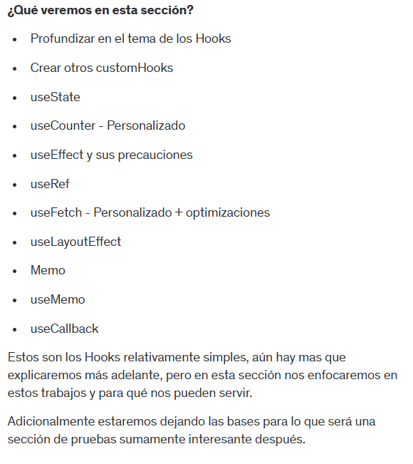

# 114. Introduccion a la sección

# 115. Temas puntuales de la seccion



# 116. Inicio de proyecto - HooksApp


# 117. useState

```jsx
import { useState } from "react";

export const CounterApp = () => {
  const [{ counter1, counter2, counter3 }, setCounter] = useState({
    counter1: 10,
    counter2: 20,
    counter3: 30,
  });
  return (
    <>
      <h1>Counter: {counter1} </h1>
      <h1>Counter: {counter2} </h1>
      <h1>Counter: {counter3} </h1>

      <hr />

      <button className="btn" onClick={() => setCounter((prevState) => ({
        ...prevState, 
        counter1: prevState.counter1 + 1,
      }))}>
        +1
      </button>
    </>
  );
};
```

# 118. useCounter - CustomHook
# 119. Exponer métodos del Hook

```jsx
import { useCounter } from "../hooks/useCounter"

export const CounterWithCustomHook = () => {
    const {counter, increment, decrement, reset} = useCounter();
  return (
    <>
        <h1>Counter with Hook: {counter} </h1>
        <hr />

        <button className="btn btn-primary" onClick={() => increment(2)}>+1</button>
        <button className="btn btn-primary" onClick={reset}>Reset</button>
        <button className="btn btn-primary" onClick={() => decrement(2)}>-1</button>
    </>
  )
}
```

```jsx
import { useState } from "react"

export const useCounter = (initalValue = 10) => {
    const [counter, setCounter] = useState(initalValue)

    const increment = (value = 1) => {
        setCounter(counter + value);
    }

    const decrement = (value = 1) => {
        if (counter === 0) return;

        setCounter(counter - value);
    }

    const reset = () => {
        setCounter(initalValue);
    }

    return {
        counter,
        increment,
        decrement,
        reset
    }
}
```

# 120. useEffect - SimpleForm

```jsx
import { useEffect, useState } from "react"

export const SimpleForm = () => {
    const [formState, setFormState] = useState({
        username: 'strider',
        email: 'nico@gmail.com'
    });

    const {username, email} = formState;

    const onInputChange = ({target}) => {
        const {name, value} = target;
        setFormState({
            ...formState,
            [name]: value
        });
    }

    useEffect(() => {
        console.log('useEffect called!');
    })

  return (
    <>
        <h1>Formulario simple</h1>
        <hr />

        <input 
            type="text" 
            name="username"
            className="form-control"
            placeholder="Username"
            value={username}
            onChange={onInputChange}
        />

        <input 
            type="email" 
            name="email"
            className="form-control mt-2"
            placeholder="walter@gmail.com"
            value={email}
            onChange={onInputChange}
        />
    </>
  )
}
```

# 121. Dependencias del useEffect

```jsx
import { useEffect, useState } from "react"

export const SimpleForm = () => {
    const [formState, setFormState] = useState({
        username: 'strider',
        email: 'nico@gmail.com'
    });

    const {username, email} = formState;

    const onInputChange = ({target}) => {
        const {name, value} = target;
        setFormState({
            ...formState,
            [name]: value
        });
    }

    useEffect(() => {
        console.log('useEffect called!');
    }, []);

    useEffect(() => {
        console.log('formState Changed!');
    }, [formState]);

    useEffect(() => {
        console.log('email Changed!');
    }, [email]);

  return (
    <>
        <h1>Formulario simple</h1>
        <hr />

        <input 
            type="text" 
            name="username"
            className="form-control"
            placeholder="Username"
            value={username}
            onChange={onInputChange}
        />

        <input 
            type="email" 
            name="email"
            className="form-control mt-2"
            placeholder="walter@gmail.com"
            value={email}
            onChange={onInputChange}
        />
    </>
  )
}
```

# 122. useEffect unmount - Cleanup

```jsx
import { useEffect, useState } from "react"
import { Message } from "./Message";

export const SimpleForm = () => {
    const [formState, setFormState] = useState({
        username: 'strider',
        email: 'nico@gmail.com'
    });

    const {username, email} = formState;

    const onInputChange = ({target}) => {
        const {name, value} = target;
        setFormState({
            ...formState,
            [name]: value
        });
    }

    useEffect(() => {
        // console.log('useEffect called!');
    }, []);

    useEffect(() => {
        // console.log('formState Changed!');
    }, [formState]);

    useEffect(() => {
        // console.log('email Changed!');
    }, [email]);

  return (
    <>
        <h1>Formulario simple</h1>
        <hr />

        <input 
            type="text" 
            name="username"
            className="form-control"
            placeholder="Username"
            value={username}
            onChange={onInputChange}
        />

        <input 
            type="email" 
            name="email"
            className="form-control mt-2"
            placeholder="walter@gmail.com"
            value={email}
            onChange={onInputChange}
        />

        {
            (username === 'strider2') && <Message />
        }
    </>
  )
}
```

```jsx
import { useEffect } from "react"

export const Message = () => {

    useEffect(() => {
      console.log('Message Mounted');
    
      return () => {
        console.log('Message Unmounted');
      }
    }, [])
    

  return (
    <>
        <h3>Usuario ya existe</h3>
    </>
  )
}
```

# 123. useEffect - Precauciones

```jsx
import { useEffect } from "react"

export const Message = () => {

    useEffect(() => {

        const onMouseMove = ({x, y}) => {
            const coords = {x, y};
            console.log(coords);
        }

        window.addEventListener('mousemove', onMouseMove)
    
      return () => {
        window.removeEventListener('mousemove', onMouseMove)
      }
    }, [])
    

  return (
    <>
        <h3>Usuario ya existe</h3>
    </>
  )
}
```

# 124. Formulario con cusom Hook

```jsx
import { useEffect } from "react"
import { useForm } from "../hooks/useForm";

export const FormWithCustomHook = () => {

    const {formState, onInputChange, username, email, password} = useForm({
        username: '',
        email: '',
        password: ''
    })

    // const {username, email, password} = formState;

  return (
    <>
        <h1>Formulario con custom Hook</h1>
        <hr />

        <input 
            type="text" 
            name="username"
            className="form-control"
            placeholder="Username"
            value={username}
            onChange={onInputChange}
        />

        <input 
            type="email" 
            name="email"
            className="form-control mt-2"
            placeholder="walter@gmail.com"
            value={email}
            onChange={onInputChange}
        />

        <input 
            type="password" 
            name="password"
            className="form-control mt-2"
            placeholder="contraseña"
            value={password}
            onChange={onInputChange}
        />
    </>
  )
}
```

```jsx
import { useState } from "react";

export const useForm = (initialForm = {}) => {

    const [formState, setFormState] = useState(initialForm);

    const onInputChange = ({target}) => {
        const {name, value} = target;
        setFormState({
            ...formState,
            [name]: value
        });
    }

    return {
        ...formState,
        formState,
        onInputChange,
    }
}
```


